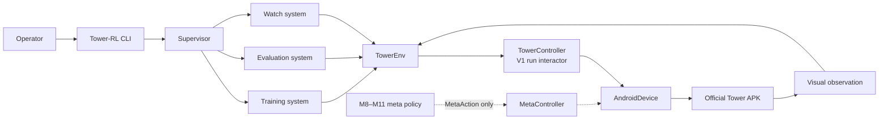
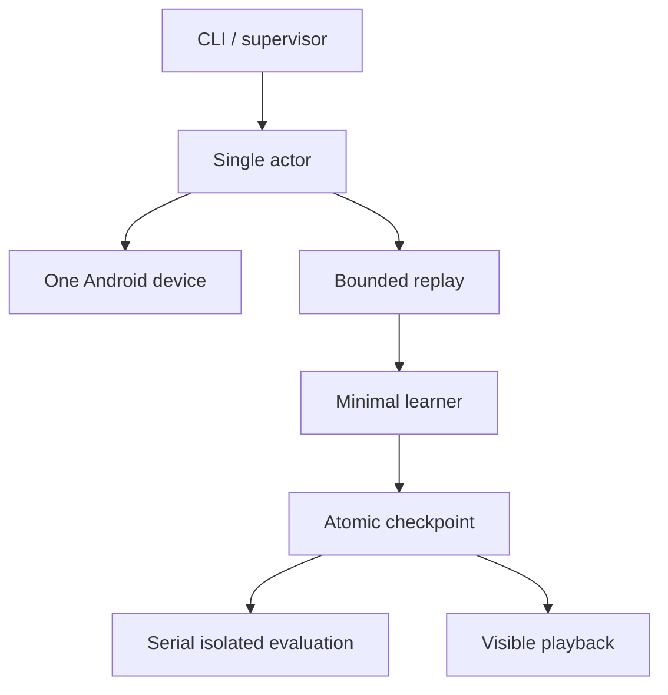
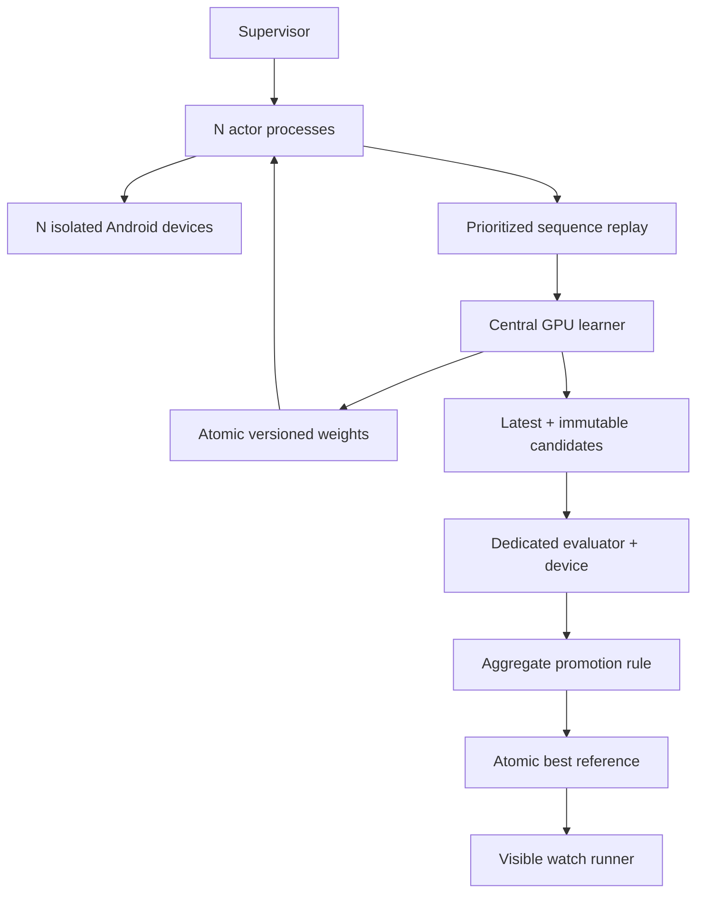
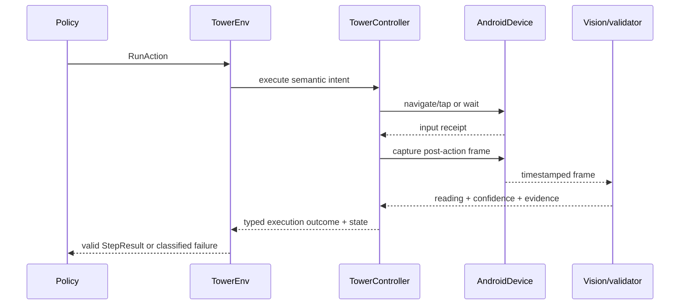

# Tower-RL — Architecture

## 1. Purpose and authority

This document is the concise structural map of Tower-RL. It explains the system's
components, boundaries, dependencies, runtime topology, authority over actions,
and principal control and data flows.

The documentation hierarchy is:

1. `task.md` defines product scope, delivery targets, acceptance gates, and the
   Definition of Done.
2. `solution.md` defines the authoritative technical approach, selected tools,
   algorithms, tradeoffs, defaults, and delivery sequence.
3. This document presents the architecture implied by that solution.
4. `environment-contract.md` defines exact observation, action, reward,
   episode, baseline, and failure schemas.
5. ADRs record consequential decisions and their rationale.

If this document conflicts with `task.md`, the task wins. If it conflicts with
an implementation choice in `solution.md`, the solution wins until the documents
are reconciled. Architecture changes must not silently broaden the learned
policy's authority or weaken an acceptance gate.

The architecture is currently a target design. The repository is at M0. A
Play-installed game has run on one candidate AVD, a snapshot-resumed offline
retry has been observed, and a bounded `tower-rl probe` now validates the pinned
visual profile and safe Home → Tier 1 → result → Home path. The full
`AndroidDevice`/`TowerEnv` contract, learner, and reliability harness remain to
be implemented.

## 2. Delivery horizons

### 2.1 Engineering MVP

The MVP is a trustworthy single-device vertical slice, not the completed V1. It
spans M0 through M3 and adds a minimal visible checkpoint-playback path:

- one genuine, unmodified game installation;
- one fixed, verified Tier-1 account baseline;
- one deterministic semantic interactor covering all supported in-run actions;
- the M2 1,000-attempt environment reliability gate;
- one real-game actor feeding replay and a minimal Double/Dueling DQN learner;
- checkpoint save, resume, and isolated evaluation;
- visible exploration-free playback of a selected checkpoint.

The MVP establishes feasibility of the complete information and control loop. It
does not satisfy the project Definition of Done.

### 2.2 Complete V1

Complete V1 spans M4 through M7 and adds recurrent distributed training,
multiple real Android actors, prioritized sequence replay, dedicated evaluation,
statistical best-model promotion, production operator commands, resource-bounded
overnight operation, and final acceptance evidence.

V1 optimizes in-run Tier-1 decisions from a fixed permanent account baseline. It
does not optimize permanent progression.

### 2.3 Post-V1 progression program

M8–M11 add the separately bounded progression program after engineering V1. It
optimizes long-horizon Tier-1 performance per real elapsed time using visible,
ordinary, earned-resource progression. `MetaObservation`, `MetaAction`,
`MetaEnv`, and `MetaController` are separate versioned types; they never union
with V1 `RunAction`, `TowerEnv`, replay, or fixed-baseline evaluation.

Only calibrated, fail-closed allowlisted capabilities may operate autonomously.
Safe deterministic reward/milestone claims may be controller-owned after their
non-strategic behavior is verified. Strategic irreversible choices remain
evaluation-gated `MetaAction` requests. This program does not change M0–M7 or
the comparability of fixed-baseline V1 results.

## 3. Architectural drivers

The architecture is shaped by these non-negotiable constraints:

- The official APK is the only authoritative gameplay environment.
- Official evaluation admits visually observable state and controller-owned
  history. Instrumented training admits only allowlisted exact state owned by the
  same running game, after bridge/visual parity.
- Learned outputs are semantic run actions, never screen coordinates.
- UI navigation is deterministic, state-aware, verified, and bounded.
- Permanent account choices are frozen for V1.
- Permanent progression is a separate M8–M11 capability domain with immutable
  verified profiles; recovery may not silently rewind a successful change.
- Timed research is progression-only; fixed-baseline run evaluation uses an
  idle/frozen profile.
- Invalid observations and failed actions cannot silently become normal replay.
- Evaluation is exploration-free and isolated from replay and learning.
- Actor failures are contained; shared learner and artifact state remain valid.
- Official evaluation uses normal game speed and ordinary Android input.
  Instrumented training may use Unity-main-thread semantic commands and a
  parity-approved in-process time scale; external clock manipulation is not
  permitted.
- Aggregate valid experience, rather than raw actor count or render frame rate,
  is the performance objective.
- Proprietary packages, account state, screenshots, replay, and models remain
  outside the public repository.

## 4. System context and authority



The boundary between decision and execution is deliberate:

- A **policy** decides which permitted semantic action to request.
- `TowerEnv` applies environment semantics, timing, validity, reward, and episode
  rules.
- `TowerController` is the V1 interactor. It converts a semantic run request into
  verified screen-state transitions.
- `AndroidDevice` performs capture and ordinary input against one isolated device.
- The official game decides all gameplay outcomes.

No component below `TowerEnv` may choose an upgrade for strategic reasons. No
component above `TowerController` may provide an uncalibrated tap location.

### 4.2 Domain-driven dependency rule

The code follows a dependency-inward rule:

```text
infrastructure  →  application  →  domain
                       ↓
                     ports
```

- `domain` owns Tier-1 concepts, invariants, schema versions, semantic actions,
  outcomes, and validation. It imports no Android, Pillow, subprocess, or CLI
  code.
- `ports` defines interfaces and value objects needed by use cases, including
  the `AndroidDevice` boundary. Ports do not implement transport.
- `application` coordinates use cases such as the bounded baseline probe and
  depends only on domain concepts and port protocols.
- `infrastructure` implements ports for ADB, screenshots, renderers, and local
  process concerns. It may depend inward, never the reverse.
- `cli` is the composition root: it wires an infrastructure adapter into an
  application service and exposes no domain policy decisions of its own.

Compatibility modules at the package root re-export the canonical domain and
port types temporarily; new code must import from the explicit packages.

### 4.1 Core real-game decision and learning loop

The conceptual loop is “agent action → interaction controller → real game →
feedback,” but the implementation keeps the environment semantics, UI
translation, device transport, and observation validation explicit:

```mermaid
flowchart LR
    subgraph Training["Training plane"]
        Replay["Prioritized sequence replay"]
        Learner["R2D2 learner"]
        Replay -->|validated sequences| Learner
    end

    subgraph Actor["One actor process"]
        Policy["Actor policy\nlocal recurrent state"]
        Env["TowerEnv\nreward · timing · mask · termination"]
        Controller["TowerController\nsemantic run interactor"]
        Navigator["Screen navigator\nverified UI transitions"]
        Vision["Vision + validator\nscreen state · fields · confidence"]

        Policy -->|RunAction| Env
        Env -->|semantic intent| Controller
        Controller -->|navigation operation| Navigator
        Vision -->|validated state + evidence| Controller
        Controller -->|typed action outcome| Env
        Env -->|StepResult\nobservation · reward · done · mask| Policy
    end

    subgraph Android["Isolated Android actor"]
        Device["AndroidDevice\nlifecycle · capture · ordinary input"]
        Game["Official Tower APK\nauthoritative game dynamics"]

        Device -->|ordinary Android input| Game
        Game -->|rendered pixels| Device
    end

    Navigator -->|calibrated input request| Device
    Device -->|timestamped frame| Vision
    Policy -->|complete valid sequences| Replay
    Learner -->|atomic versioned weights| Policy
```



“Feedback” is therefore not a direct game-to-agent signal. `TowerEnv` returns a
validated `StepResult` containing the observation, reward, termination status,
action mask, and typed action outcome. Screenshots, coordinates, navigation
failures, and device lifecycle details remain below the environment boundary.

The learner is also distinct from the actor policy. Actors collect genuine game
sequences with local inference copies; replay validates and stores those
sequences; the central learner publishes immutable weights back to actors.
Recovery and baseline restoration are supervisor/controller operations and never
learned actions.

## 5. Action domains

Tower-RL keeps three action domains type-separated.

| Domain | Examples | Authority in V1 |
| --- | --- | --- |
| Run actions | `WAIT`, `BUY_HEALTH`, `BUY_DAMAGE` | Learned run policy |
| Navigation commands | select tab, scroll, start T1, close a known modal | `TowerController` only |
| Meta actions | spend coins, start Lab research, strategic milestone choice | Separate M8–M11 `MetaEnv`; absent from V1 API |

The separation is enforced in code and configuration, not only by convention.
`TowerEnv.step` accepts only the versioned `RunAction` type. Navigation commands
are private implementation details of the controller. No V1 enum contains a
permanent-progression action.

The M8–M11 progression system uses a separate `MetaAction` schema and separate
`MetaEnv`/`MetaController` boundary. Reuse of screen recognition or the device
adapter does not grant a run policy access to meta actions.

## 6. Logical components

### 6.1 CLI and configuration

The CLI exposes `doctor`, `calibrate`, `train`, `evaluate`, and `watch`. It
resolves configuration once, validates compatibility, and hands an immutable
resolved configuration to the supervisor. Individual processes do not reinterpret
configuration independently.

### 6.2 Supervisor

The supervisor owns local process and device lifecycle. It starts dependencies in
order, assigns one device to one worker, enforces restart budgets, quarantines
failed actors, coordinates graceful shutdown, and produces the run manifest.

The supervisor controls processes, not game strategy.

### 6.3 `AndroidDevice`

`AndroidDevice` is the platform boundary. It owns:

- device start, stop, health, and stable identity;
- atomic installation and verification of the complete split-APK set;
- app launch and foreground checks;
- timestamped screenshot capture;
- calibrated ordinary input events;
- baseline restoration;
- bounded device failure evidence.

It contains no RL types, reward logic, or upgrade-selection logic. Emulator-
specific commands stay behind this interface.

### 6.4 Vision and screen model

The vision subsystem converts timestamped frames into evidence-bearing field
readings and a classified screen state. It owns image normalization, anchors,
regions of interest, numeric recognition, button state, tab state, confidence,
and temporal validation.

It does not infer hidden game mechanics. A missing or contradictory value remains
missing or invalid; it is never replaced with an ordinary value such as zero.

### 6.5 Screen navigator

The navigator implements the explicit screen-state machine. Every navigation
operation declares:

- permitted source state;
- semantic destination;
- calibrated interaction sequence;
- visual confirmation predicate;
- timeout and retry budget;
- typed failure outcome.

It does not expose generic unrestricted tapping to policies or orchestration.

### 6.6 `TowerController`

`TowerController` is the V1 semantic run interactor. It composes the navigator,
vision subsystem, UI profile, and device adapter to:

- reach and verify a Tier-1 run;
- perform the cross-tab bootstrap observation scan;
- execute `WAIT` or one supported purchase;
- select the necessary tab and control without exposing coordinates;
- verify purchase success, rejection, or ambiguity;
- detect game over and start the next run normally;
- request recovery when invariants fail.

Its cached levels, costs, tab, and timestamps are memories of observed UI and
executed actions. They are not a game simulator.

### 6.7 `TowerEnv`

`TowerEnv` is the sole boundary presented to policies. It owns:

- reset and step semantics;
- normalized observations and valid-action masks;
- decision timing and elapsed-time records;
- reward calculation;
- termination and truncation classification;
- transition validity;
- episode identity and summary emission.

It emits a transition only after the resulting observation is valid. Environment
failures are diagnostic outcomes, not implicit waits or game deaths.

### 6.8 Actor worker

One actor process owns one `TowerEnv`, one local inference copy, and exactly one
Android device. It owns recurrent episode state, exploration identity, sequence
assembly, weight adoption, replay submission, and actor health metrics.

The process boundary prevents device or recurrent-state failures from crossing
actor identities.

### 6.9 Replay service

Replay is a bounded, schema-validating store of complete sequences. It rejects
incompatible, corrupt, invalid, incomplete, or out-of-order payloads. It exposes
capacity, storage, age, sampling, and rejection health.

Replay is never written by evaluation or watch mode.

### 6.10 Learner and weight publisher

The learner is the only owner allowed to mutate model and optimizer state. It
samples replay, computes recurrent Q-learning updates, returns priorities, writes
atomic checkpoints, and publishes immutable versioned weights.

Actors adopt only complete compatible weight versions.

### 6.11 Evaluator and promoter

The evaluator owns a dedicated real-game device. It executes complete episodes
with exploration, learning, and replay writes disabled. It produces an immutable
candidate report.

The promoter operates only on a completed compatible report and atomically changes
the `best` reference when the configured aggregate rule passes.

### 6.12 Watch runner

Watch mode uses one visible device and a selected checkpoint, `best` by default.
It shares the production `TowerEnv` and controller while disabling exploration,
learning, replay, and checkpoint mutation. Telemetry is displayed separately from
the automated game controls.

### 6.13 Artifact and telemetry services

Artifact management owns manifests, resolved configuration, checkpoints,
evaluations, episode summaries, replay metadata, and bounded failure bundles.
Telemetry owns structured logs, metrics, and concise operator health output.

Atomicity, checksums, compatibility identifiers, and retention are cross-cutting
requirements of both components.

### 6.14 `MetaEnv` and `MetaController` (M8–M11)

`MetaEnv` owns progression observation, long-horizon reward/evaluation context,
profile identity, and capability-compatible `MetaAction` admission. `MetaController`
executes only calibrated ordinary earned-resource paths, confirms outcomes, and
may make a deterministic non-strategic claim without asking a policy. Strategic
or irreversible choices remain `MetaAction` requests and must pass the configured
evaluation gate before autonomous operation. Both components fail closed for
unknown, new, modal-ambiguous, real-money/store purchase, advertisement,
credential, cloud/save, tournament, competitive, event, and bypass capabilities.

## 7. Dependency rules

The intended dependency direction is:

```text
CLI / orchestration / policies / learning
                  |
              TowerEnv
                  |
            TowerController
             /           \
      screen model     navigator
             \           /
              AndroidDevice
```

Rules:

1. Android and vision packages cannot import learner, replay, or policy packages.
2. Learner and policy packages cannot import emulator, ADB, UI-profile, coordinate,
   or image-recognition types.
3. `TowerEnv` depends on semantic controller protocols, never a concrete emulator.
4. Coordinates exist only in versioned UI-profile and navigation code.
5. Artifacts cross process boundaries through versioned messages and records, not
   shared mutable Python objects.
6. Evaluation and watch reuse environment code but receive capability-limited
   sinks that cannot write replay or model state.
7. Permanent-progression capabilities are absent from V1 process APIs and use
   separately versioned M8–M11 records.

Fast contract tests must enforce the most important import and message-boundary
rules where practical.

## 8. Runtime topologies

### 8.1 MVP topology



MVP services may be separate local processes even when they run serially. Their
messages already carry the identifiers required by the production topology.

### 8.2 Complete V1 topology



V1 is a single-workstation deployment. A remote actor fleet or cluster manager is
not part of the architecture.

## 9. Principal flows

### 9.1 Environment decision



An ambiguous postcondition cannot be reported as success. An invalid observation
cannot produce an ordinary replay transition.

### 9.2 Weight publication

Actors produce versioned sequences. Replay validates and stores them. The learner
samples compatible sequences, updates its exclusive model state, and publishes a
new immutable weight version. Actors adopt it only at a safe inference boundary
and tag subsequent data with that version.

### 9.3 Evaluation and promotion

A checkpoint becomes an immutable evaluation candidate. The evaluator completes
the configured number of valid episodes and writes the report before the promoter
runs. Partial, interrupted, incompatible, or excessively invalid evaluations
cannot update `best`.

### 9.4 Recovery

Recovery escalates from fresh capture, supported navigation, app restart, device
restart, and baseline restoration to quarantine. Each step is bounded and
evidence-backed. Ordinary game death uses the normal new-run path; baseline
restoration is exceptional recovery.

## 10. Baseline and progression boundary

The V1 baseline freezes every permanent choice known to influence a run,
including Workshop levels, completed Labs, Cards or other unavoidable effects,
game speed, app version, and device/UI profile.

V1 permits unavoidable persistent currency balances to change only when evidence
shows that the balance itself cannot affect combat without a prohibited meta
action. In V1, coins, gems, cells, milestones, and similar persistent resources
are not policy observations and are never spent or claimed by automation.

M8–M11 progression profiles are distinct from the fixed V1 baseline. Each
successful permanent change creates a new immutable, verified profile linked to
its parent and visible-state fingerprint. Recovery verifies the current profile
and must not silently restore an earlier one. Every run record carries the exact
profile identity; replay and evaluation reject incompatible profiles. Timed
research may run only in progression mode. Fixed-baseline run training and
evaluation require an idle/frozen profile.

Before creating the baseline:

- no Lab may be actively progressing or auto-repeating;
- the supported account configuration must be deliberately selected;
- unsupported features and expected badges/modals must be inventoried;
- the normal death-to-new-run path must be shown not to alter combat state.

Baseline verification runs before episode admission and periodically thereafter.
Unverifiable drift is an integrity failure that stops or quarantines the actor.

The local Android state has two distinct checkpoints:

1. a **post-consent setup state** after user-owned legal/first-run interactions;
2. a **golden Tier-1 baseline** after the desired legitimate progression is
   reached, permanent choices are inventoried, and all Lab activity is idle.

Both are local, ignored runtime artifacts tied to one AVD/system-image/emulator
version. The app uses online identity and cloud-save services, so restoring a
local snapshot does not prove that server-side state was rewound. Every restore
must revalidate the visible baseline. Cloning one online identity into concurrent
actors remains unsupported until an explicit compatibility and isolation test
shows it is safe.

## 11. Performance architecture

Tower-RL distinguishes game-time speed from system throughput.

### 11.1 Game-time speed

The official controller selects and verifies one normal in-game speed supported
by the fixed baseline. That speed remains the authoritative evaluation/watch
profile. Per ADR 0006, the separate instrumented-training profile may select a
higher in-process Unity time scale only after deterministic and distributional
parity, reliability, and throughput gates. Each accepted speed is a distinct
environment compatibility value. External clock manipulation remains outside
the system.

### 11.2 Emulator and observation efficiency

The Android execution profile versions:

- system image, ABI, API level, and hypervisor;
- renderer and graphics mode;
- logical resolution, density, orientation, and headless/visible mode;
- screenshot transport and recognition configuration;
- in-game speed and environment decision timing.

M0 benchmarks candidate accelerated renderers and one low-but-readable fixed
resolution. A headless window reduces display overhead but does not change the
game's authority over time or outcomes. Any profile that changes pixels, timing,
or failure behavior must pass fixture, integration, and reliability validation.

### 11.3 Aggregate scaling

After M2, scale by adding independent actors while measuring:

- actual wave progress per wall-clock time;
- valid decisions and episodes per hour;
- capture, extraction, action, and inference latency;
- invalid observation and actor failure rates;
- per-actor CPU, RAM, GPU, and storage cost;
- learner starvation or GPU contention.

The production actor count is the measured stable throughput optimum. Rendering
FPS and configured actor count are diagnostic inputs, not success metrics.

## 12. Data, identity, and compatibility

Every cross-component record carries enough identity to reject accidental mixing:

- run, actor, device, episode, frame, and local sequence identity;
- APK, baseline, UI profile, and Android execution profile identity;
- observation, action, reward, replay, and model schema versions;
- model version and checkpoint checksum;
- source revision and resolved configuration identity.

Compatibility is fail-closed. Schema migration is an explicit tool or release
operation, never a partial implicit load.

## 13. Failure containment

Failures are contained at the narrowest owner:

| Failure | Primary owner | Architectural response |
| --- | --- | --- |
| Field recognition invalid | Vision/controller | Retry capture, then fail the attempt |
| Purchase ambiguous | Controller | Do not assert success; classify and recover |
| UI state lost | Navigator/controller | Bounded state recovery |
| Device unhealthy | Actor/supervisor | Restart or quarantine one actor |
| Baseline drift | Baseline guard/supervisor | Stop admission and restore or quarantine |
| Replay incompatibility | Replay | Reject payload and alert |
| Learner numeric failure | Learner/supervisor | Stop mutation and preserve last good state |
| Evaluation interruption | Evaluator/promoter | Preserve incumbent `best` |
| Artifact write failure | Artifact manager | Preserve prior atomic artifact |

No recovery path converts an unknown condition into an ordinary gameplay event.

## 14. Repository and trust boundaries

The public repository contains code, safe configuration examples, sanitized test
fixtures, and non-proprietary compatibility metadata. It excludes game packages,
extracted game files, account data, Android images, snapshots, screenshots with
user data, replay, checkpoints, logs, and bulk diagnostics.

Runtime directories are local and retention-bounded. Failure capture is scoped to
the game device and avoids purchase, account, advertising, or unrelated personal
screens wherever possible.

## 15. Evolution and implementation status

| Capability | First required gate | Current state |
| --- | --- | --- |
| XAPK and host characterization | M0 | In progress |
| One compatible Android profile | M0 | Not selected |
| `AndroidDevice` and visual control | M1 | Not implemented |
| Trusted `TowerEnv` | M2 | Not implemented |
| Single-actor learning MVP | M3 | Not implemented |
| Distributed recurrent training | M4 | Not implemented |
| Evaluation promotion | M5 | Not implemented |
| Complete operator modes | M6 | Not implemented |
| Final acceptance evidence | M7 | Not started |
| Meta contract and capability safety | M8 | Not started |
| Verified progression lifecycle | M9 | Not started |
| Long-horizon progression control/evaluation | M10 | Not started |
| Progression validation and handoff | M11 | Not started |

Update this table only from recorded evidence. A launched APK, mock adapter, or
running learner does not advance a gate by itself.
