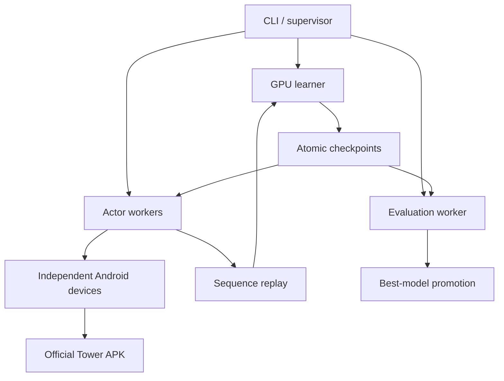

# Tower-RL — Technical Solution

## 1. Purpose and relationship to `task.md`

This document defines **how** to deliver the outcome specified in `task.md`.

`task.md` remains authoritative for scope, acceptance criteria, boundaries, and Definition of Done. This solution supplies the technical approach, implementation strategy, selected tools, data contracts, reinforcement-learning design, verification approach, and staged delivery plan. `architecture.md` is the concise structural view derived from this solution: it shows component boundaries, dependency rules, runtime topology, action authority, and principal flows without replacing this document as the authority for technical choices.

When implementation evidence invalidates a technical decision here, update this document and record the reason. Do not silently weaken a requirement from `task.md`. If the task and solution conflict, the task wins until both are deliberately reconciled.

## 2. Solution summary

Build the V1 system in two layers that meet at a strict run-environment interface:

1. **Real-game environment layer** — manages independent Android instances running the official APK, turns screenshots into validated structured observations, translates semantic actions into UI interactions, controls episode lifecycle, and produces trustworthy transitions.
2. **Learning and operations layer** — runs distributed recurrent Q-learning, replay, checkpointing, evaluation, promotion, metrics, and the user-facing commands.

After M7, add a separate progression bounded context for M8–M11. Its
`MetaObservation`, `MetaAction`, `MetaEnv`, and `MetaController` may reuse the
device, navigator, and visible-state extraction layers, but not `TowerEnv`'s
action space, replay, or fixed-baseline evaluation records. Its objective is
long-horizon Tier-1 performance per real elapsed time, not V1 final-wave ranking.

The real APK is always authoritative. The system does not recreate game rules or generate synthetic Tower transitions.

The initial production topology is a single workstation:



Prototype with one standard Android virtual device. Scale only after the single-actor reliability gate passes. Use multiple standard emulator devices first; evaluate Cuttlefish on native Linux only if standard devices become the demonstrated scaling bottleneck and the APK/device compatibility permits it.

The single-device prototype runs first on the Apple M2 Pro/16 GB development
host with a native ARM64 Android image. Multi-actor scale validation moves later
to the 28 GB/RTX 4090 workstation after its host OS, CPU, virtualization, and
compatible Android ABI path are characterized. Results from one host do not
silently establish performance or renderer compatibility on the other.

## 3. Guiding decisions

### 3.1 Environment correctness comes before RL

No learner may train on the environment until a deterministic scripted controller passes the 1,000-attempt reliability gate. Incorrect observations and episode boundaries create plausible-looking but poisoned replay data, making RL failures extremely difficult to diagnose.

### 3.2 Separate instrumented training from official evaluation

Per ADR 0006, training may use a private rooted clone, a reversible native-library
overlay, exact IL2CPP observations, and Unity-main-thread semantic commands. The
unchanged unrooted Play-installed package remains authoritative for normal-speed,
pixel-observed evaluation and headed watch mode. Neither profile bypasses
licensing/integrity, edits saves, or automates transactional or competitive paths.

### 3.3 Separate normal reset from recovery

Normal episode reset is the game's own death-to-new-Tier-1 flow. A golden device baseline is a recovery mechanism, not the default hot-path reset. This preserves naturally changing random state and avoids paying snapshot restoration cost after every death.

### 3.4 Use semantic actions

The policy chooses actions such as `BUY_HEALTH`; it never predicts coordinates. An Android adapter owns tab selection, taps, timing, verification, and recovery.

### 3.5 Start simple, then activate R2D2 features

Validate the complete data path with random and scripted policies, then a minimal Double/Dueling DQN, then the final recurrent distributed configuration. Each stage uses the same versioned environment contract. Complexity is enabled only after the preceding stage is known to work.

### 3.6 Optimize aggregate real experience

Measure both in-process game-time acceleration and actor parallelism on the
instrumented-training profile. Admit only speed/actor combinations that preserve
normal-speed scripted behavior and maximize aggregate valid experience. A faster
renderer alone does not imply faster game time.

### 3.7 Keep evaluation independent

Evaluation has no exploration, no gradient updates, no replay writes, and no best-model promotion until its run is complete and valid. The evaluator uses a dedicated device so training failures or actor lag cannot affect results.

## 4. Reconnaissance and technical decision record

The first implementation work is a read-only compatibility assessment. Record its output in a machine-readable `environment-profile.yaml` and a human-readable section in `docs/experiments.md`.

Discover, do not assume:

- host OS, CPU model/core count, virtualization support, RAM, GPU driver, CUDA availability, free storage, and filesystem performance;
- APK package name, version, minimum/target Android SDK, supported ABIs, installability, and whether it requires Google Play services;
- whether the app runs without competitive, purchase, advertising, or cloud features being exercised;
- supported virtual-device images and rendering modes;
- stable logical screen size, density, orientation, font scaling, language, theme, and game UI scale;
- available Tier-1 upgrades and in-game speed for the chosen fixed account state;
- death/result/start screen appearance and any recurring modal screens;
- whether normal replay changes any permanent combat-affecting state;
- whether device snapshot restore preserves unwanted identical random sequences;
- per-device CPU, RAM, GPU/render, capture, and disk cost.

### 4.1 Android backend decision

Use this decision order:

1. **Standard Android emulator** for the one-actor prototype because it has the lowest setup and debugging cost.
2. **Multiple isolated standard AVDs** for the first parallel benchmark.
3. **Cuttlefish on native Linux** only when all of the following are true:
   - the host and APK are compatible;
   - M2 already passes;
   - profiling identifies Android-instance overhead as a real throughput constraint;
   - a small Cuttlefish trial preserves observation/action behavior;
   - the migration increases valid aggregate throughput or reliability enough to justify operational complexity.
4. If the APK supports only an ABI that cannot run efficiently on the preferred backend, document the constraint and select a compatible backend rather than modifying the APK.

The environment and learner must depend on an `AndroidDevice` interface, not on emulator-specific commands, so a backend can change without changing RL code.

For the supplied The Tower 29.0.1 XAPK on the ARM64 macOS development host, the plain API 36
`google_apis` image is rejected: after first-run consent it exposes no Play
Billing service and the game stalls at purchaser initialization. The API 36
`google_apis_playstore` ARM64 image exposes that service, but the unentitled
ADB-installed game still reports billing as unsupported. After user-owned Play
Store sign-in and installation from the production listing, version 29.0.3
(`versionCode=1199`) completed purchaser initialization and entered Tier 1. This
Play-installed build replaces the supplied XAPK as the runtime candidate.

A named snapshot of the running game can be resumed with Android networking
disabled, and one no-action offline retry cycle has completed. A force-stopped
game cannot currently cold-launch offline: Google Play intercepts startup with
its licensing panel. Offline actors therefore require snapshot-resume semantics
plus explicit aging, recovery, identity, and randomness validation; offline mode
is not assumed to remove account or service constraints. The image becomes
selected only after baseline, navigation, snapshot, renderer, and isolation
validation complete. Do not falsify installer identity, bypass Play licensing,
automate credentials, make purchases, or automate advertisements.

## 5. Repository structure

A Python package with feature-oriented boundaries:

```text
Tower-RL/
├── README.md
├── AGENTS.md
├── pyproject.toml
├── uv.lock
├── docs/
│   ├── task.md
│   ├── solution.md
│   ├── architecture.md
│   ├── environment-contract.md
│   ├── environment-profile.yaml
│   ├── setup.md
│   ├── workstation-handoff.md
│   ├── experiments.md
│   ├── rl-candidates.md
│   └── adr/
├── src/tower_rl/
│   ├── environment/         # what a run is: actions, state, features, episode, port, decision cost
│   ├── simulation/          # reaching one instance: SDK, instance, bring-up, frame rate, bridge, adapter, fleet
│   ├── learning/            # policies, network, backbone, replay, actor, learner, training run, evaluator, checkpoint
│   ├── experiment/          # run identity, metrics, tracking, reports, comparison, wave statistics
│   ├── doctor.py            # host and package checks
│   └── xapk.py
├── tests/
│   ├── unit/                # including unit/simulation/
│   └── fakes/
├── scripts/                 # composition roots; the twelve entry points listed in section 11
└── state/                   # ignored; bridge, runs, records, recordings, logs, mlflow.db
```

`docs/architecture.md` states the dependency rule between those packages;
`tests/unit/test_import_contracts.py` enforces it.

Keep proprietary and generated material out of Git. `.gitignore` must cover the APK, Android device data, user/account state, golden snapshots, screenshots containing user data, replay storage, checkpoints, logs, and local runtime configuration.

Use Python 3.12 unless the selected PyTorch/Android integration on the target host requires a different supported version. Manage dependencies and reproducible commands with `uv`. Use PyTorch for the model and learner. Prefer small, explicit internal abstractions over adopting a large distributed-RL framework before the environment is proven. TorchRL components may be used where they reduce risk, but the stored data contracts and orchestration must remain project-owned and testable.

The package is four feature packages in one direction, not layers; the rule is
stated once in `docs/architecture.md` section 1 and enforced by
`tests/unit/test_import_contracts.py`. The earlier
`domain`/`ports`/`application`/`infrastructure` layering and the `tower-rl` CLI
composition root no longer exist (`M0-E010` is superseded).

The M0 `probe` uses Pillow only for deterministic PNG decoding and conservative
profile-anchor checks. It is a transport and navigation smoke tool, not the
final observation extractor; the planned vision layer remains OpenCV-backed and
must pass the fixture-accuracy gate before training.

## 6. Component architecture

### 6.1 `AndroidDevice`

Responsibilities:

- start, stop, connect, and health-check one configured device;
- identify the device by a stable actor-to-serial mapping;
- install/verify the configured APK version;
- capture a screenshot with timestamp and sequence number;
- send taps and only other explicitly supported normal input events;
- expose device/application lifecycle status;
- restore the actor's golden baseline;
- collect targeted failure artifacts such as screenshot and relevant device logs.

Representative interface:

```python
class AndroidDevice(Protocol):
    def start(self) -> None: ...
    def stop(self) -> None: ...
    def health(self) -> DeviceHealth: ...
    def screenshot(self) -> CapturedFrame: ...
    def tap(self, point: ScreenPoint) -> InputReceipt: ...
    def app_foreground(self) -> bool: ...
    def launch_app(self) -> None: ...
    def restore_baseline(self, baseline_id: str) -> None: ...
```

No RL type belongs in this package.

### 6.2 UI profile and calibration

All coordinates and regions of interest live in a versioned UI profile keyed by:

- app package/version;
- logical resolution and density;
- orientation;
- locale;
- game UI layout/version;
- profile schema version.

A profile contains normalized coordinates, region definitions, reference templates, expected colors/layout anchors, and extractor settings. Coordinates are stored normalized to the logical screenshot dimensions where possible, but profile validation must still reject unsupported aspect ratios or layouts.

`tower-rl calibrate` must:

1. capture representative screens;
2. identify stable anchors;
3. establish regions for wave, cash, health, tabs, upgrades, costs, buttons, start, death/result, and recurring supported modals;
4. create or update a profile;
5. run non-destructive recognition checks;
6. require deliberate confirmation before any calibration tap that could affect the account;
7. emit a compatibility report and fixtures for regression tests.

Calibration output is data, not scattered constants in code.

### 6.3 Instrumented training bridge

The training-only native bridge is a small ARM64 shared library loaded through a
reversible bind-mounted `libunity.so` view on a private rooted actor clone. It
contains no game assets or extracted proprietary code. Its responsibilities are:

- perform a versioned handshake containing package/library hashes, Unity and
  IL2CPP metadata versions, bridge/protocol version, actor id, and time scale;
- resolve IL2CPP exports dynamically and locate allowlisted classes, fields, and
  methods by semantic name;
- emit monotonic observation snapshots and lifecycle events over a loopback socket
  exposed to the host with ADB forwarding;
- represent `WAIT` as a bounded host-owned interval ending in a fresh exact
  observation, and dispatch purchase mutations only through an established
  Unity-main-thread safe point;
- return before/after state and an explicit applied, rejected, stale, or failed
  action result; and
- stop admitting transitions when compatibility, heartbeat, sequence, thread,
  lifecycle, or pixel-watchdog checks fail.

The bridge observes game-owned lifecycle, wave, cash, tower health, terminal
state, and all supported upgrade costs/levels/availability. It invokes only the
game's normal earned-cash in-run purchase methods. It does not calculate costs,
combat, rewards, outcomes, or save mutations itself.

For the version-locked 29.0.3 profile, private scene inspection confirms the
target GameObject is named `Main`. The single attached bridge thread writes the
aligned `IntSelect.upgradeSelect` integer only after validating the current
inventory and admitting exactly one purchase command. It then calls exported
`UnitySendMessage` for `Main.UpgradeButton`, `Main.UpgradeDefenseButton`, or
`Main.UpgradeUtilityButton`; Unity owns delivery and executes the purchase method
on its main thread. The selection write is command-mailbox coordination, not a
purchase mutation, and no second command or UI actor may race it. Only the game's
own level increment in a strictly newer exact observation can mark the command
applied; timeout or contradictory change is ambiguous and quarantines the actor.
In-run cash rises continuously from kills, so a cash delta is evidence recorded
with the transition, never the confirmation signal itself.

Which rows are available at all is a configuration of the environment rather
than a property of the image. `--upgrade-availability image` is the default and
is what every baseline so far was measured under: the six rows the v1 image
offers. Under `all` the environment reopens every row the game really has, at
each round start, through the bridge - the game recomputes its real rows'
availability whenever a round begins, so the write belongs to the round start
and nowhere else, and a "profile v2 base image" could not have carried it
(`M2-E008`, [ADR 0011](adr/0011-upgrade-availability-is-applied-at-round-start.md)).
The profile id is the image's under either value; the availability travels in
the run identity and in every record, and the baselines belong to the
availability they were collected under.

Live 29.0.3 evidence in `M1B-E001` constrains two further details. In-run
availability is `unlocked`, not `maxed`, and a positive cost within current cash;
`tier_unlocked` is reported state and is false for every offered upgrade, so it
never gates a purchase. A family's cost array is only populated once that family
has been displayed during the run, so the actor opens each family tab once at run
start and any entry without a positive cost stays masked and is rejected by the
bridge. Removing that per-run step requires identifying the game's own cost
refresh path; until then it is an explicit documented actor step rather than a
silent assumption.

IL2CPP resolution happens on the first host connection and is then cached.
`libil2cpp.so` is loadable long before its runtime is usable, and resolving at
library-load time kills the game process; a connecting client is the evidence
that the game has initialized.

The host-side `InstrumentedTowerDevice` owns ADB forwarding, protocol framing,
timeouts, compatibility policy, overlay lifecycle, and cleanup. The environment
consumes the same semantic observation/action contracts regardless of whether the
source is the bridge or visible controller. Replay manifests additionally bind
instrumented transitions to bridge and speed profiles.

Throughput comes from two separate mechanisms that are often confused. The
renderer is an enabler: Unity clamps how much game time one frame may advance, so
a low frame rate caps the usable time scale. Host GPU rendering on the clone
removes that ceiling, and it is safe there because the clone needs pixels only
for two boundary classifications per episode, not for reading state. The time
scale is the actual mechanism, applied through the game's own speed modifier.
`M1B-E003` measured no saturation through 64x at roughly two thirds of nominal,
about twenty-four times the episode throughput of the normal-speed reference.

A renderer or resolution change must be re-validated against the screen
classifier before any unattended run, because the boundary taps depend on it.

**Training collection and evaluation deliberately run on different bridge
builds.** The default build (`state/bridge/current`) renders every frame and
is what every baseline and formal evaluation has ever been measured under.
An experiment variant built with `TOWER_BRIDGE_RENDER_FRAME_INTERVAL=16`
renders one player-loop frame in sixteen; fleet equivalence held on final
wave, decisions/wave, and `advances_cut_short`, and per-actor collection
throughput was 1.92× the default build's (`#27` stage 3, `docs/experiments.md`).
The Lead decision (2026-09-24) adopted the render-interval-16 build for
**training collection only**: evaluation arms stay on the default build so
their numbers remain like-for-like with the baselines and with run 4, and
`scripts/spectate.py` recordings never use it, because a human-facing
recording must show the game rendering normally. The build is selected per
stage by `TOWER_BRIDGE_BUILD_DIR`, never by repointing `state/bridge/current`,
so the split is reversible per invocation with no code change either way.

Sparse visual captures independently check lifecycle state and provide failure
artifacts. Normal-speed parity runs compare the bridge actor with the existing
visible actor before training, and each higher time scale repeats deterministic,
distributional, latency, and soak checks before allowlisting.

### 6.4 Vision and structured state extraction

Use a layered extractor:

1. normalize screenshot dimensions and color representation;
2. classify the current screen/state using anchors and templates;
3. crop fixed regions of interest;
4. parse numeric fields with field-specific preprocessing;
5. recognize button enabled/disabled state and selected tab;
6. combine new readings with controller-owned cached upgrade state;
7. validate temporal and logical consistency;
8. return a structured state plus per-field confidence and evidence references.

Use OpenCV for cropping, thresholding, template matching, and image comparison. Select the numeric recognizer after fixture benchmarking. A small constrained digit classifier is preferable if general OCR is unreliable; general OCR remains acceptable when it meets the field-level accuracy gate. Do not make an external network service part of the observation path.

Each parsed field returns:

```python
@dataclass(frozen=True)
class FieldReading[T]:
    value: T | None
    confidence: float
    source_frame_id: str
    region_id: str
    reason: str | None
```

The `ObservationValidator` checks:

- mandatory fields are present for the current screen;
- confidence exceeds field-specific thresholds;
- wave does not move backwards inside a valid episode;
- cash, levels, prices, and health stay within configured numeric bounds;
- an upgrade level changes only after a verified purchase or known game-driven effect;
- the frame is newer than the prior observation;
- cached values are not older than their allowed staleness;
- UI state and extracted controls are mutually consistent.

On failure, retry with fresh captures and alternate preprocessing a bounded number of times. Then classify the episode/actor failure and recover. Never replace a missing reading with zero.

#### Cross-tab freshness

Only one upgrade tab may be visible at a time, while the policy needs a coherent action mask across every supported upgrade. Handle this explicitly:

1. perform a standardized bootstrap scan of every supported tab at the start of an episode before the first learned decision;
2. read the active tab on every decision;
3. update the controller cache immediately after a confirmed purchase;
4. mark cached values with their source frame and age;
5. refresh non-active tabs on a bounded schedule and whenever visible game behavior can change upgrades without a policy purchase;
6. mask actions whose required cost/level reading exceeds the tested freshness limit;
7. record navigation time spent refreshing so timing analysis includes observation overhead.

The bootstrap/refresh policy must be identical for training and evaluation. If scanning materially harms gameplay or throughput, change it only through a versioned environment experiment; do not silently allow indefinitely stale cross-tab values.

### 6.5 Screen-state machine

All UI automation passes through an explicit state machine:

```text
BOOTING
APP_HOME
TIER_SELECT
RUN_ACTIVE_ATTACK
RUN_ACTIVE_DEFENSE
RUN_ACTIVE_UTILITY
RUN_PAUSED_OR_MODAL
RUN_RESULT
RECOVERING
UNSUPPORTED
```

State transitions require visual evidence. Timeouts never imply success. Unexpected states capture evidence and enter bounded recovery. Repeated failure quarantines the actor.

Do not implement a generic "tap until it works" loop. Each transition has:

- allowed source states;
- intended target state;
- action;
- confirmation predicate;
- timeout;
- retry budget;
- failure classification.

### 6.6 `TowerController`

`TowerController` is the V1 run interactor. It converts semantic intent into state-machine transitions.

Responsibilities:

- reach a verified Tier-1 start;
- observe the current run;
- execute a supported semantic purchase;
- execute `WAIT` without input;
- confirm purchase success/failure;
- detect run death/result;
- restart Tier 1 normally;
- request baseline recovery when invariants fail.

It maintains controller-owned facts such as the last successful action, last verified upgrade levels/costs, current tab, and timestamps. This is memory of observed UI and executed actions, not a reimplementation of game mechanics.

Keep action domains type-separated:

- `RunAction` contains only `WAIT` and supported in-run purchases and is the only
  learned action type accepted by `TowerEnv.step`;
- navigation commands are private controller operations;
- permanent `MetaAction` operations such as Workshop spending or Lab scheduling
  are absent from V1 APIs and exist only in the M8–M11 progression context.

The M8–M11 progression context reuses the device, vision, and navigator layers
through a separate `MetaEnv` and `MetaController` contract. That reuse does not
grant the V1 policy permanent-progression authority.

### 6.7 `TowerEnv`

Expose an environment independent of Android details:

```python
class TowerEnv:
    def reset(self) -> tuple[RunObservation, EpisodeInfo]: ...
    def step(self, action: RunAction) -> StepResult: ...
    def recover(self) -> RecoveryResult: ...
    def close(self) -> None: ...
```

`StepResult` contains:

- current and next observation identity;
- action and action mask;
- action execution outcome;
- scalar reward;
- terminated/truncated flags;
- termination reason;
- elapsed real/game time where observable;
- validity classification;
- diagnostic metadata.

The environment emits no transition until the next observation has passed validation. Invalid environment attempts are routed to diagnostics and episode classification, not silently represented as ordinary `WAIT` steps.

### 6.8 Actor worker

One actor process owns one `TowerEnv` and one local inference model. This gives device failure isolation and avoids cross-actor recurrent-state mixing.

The actor:

- obtains the latest approved training weights;
- runs epsilon-greedy inference;
- applies the valid-action mask before action selection;
- maintains recurrent hidden state for the current episode;
- assembles overlapping fixed-length sequences;
- sends complete valid sequences to replay ingestion;
- emits episode and health metrics;
- resets recurrent state on episode boundary;
- quarantines itself after repeated environment failures;
- can be restarted by the supervisor without affecting other actors.

Actor messages always include `actor_id`, `device_profile_id`, `baseline_id`, `observation_schema_version`, `action_schema_version`, `model_version`, `episode_id`, and monotonically increasing local sequence numbers.

### 6.9 Replay service

Use a bounded central prioritized sequence replay store. Start with a single dedicated process on the workstation.

Requirements:

- store sequences, not isolated transitions;
- retain episode-boundary and burn-in information;
- validate schemas and checksums at ingestion;
- reject incomplete, invalid, incompatible, or out-of-order payloads;
- sample by priority without mixing incompatible schema/environment versions;
- update priorities after learner feedback;
- expose fill level, age distribution, sampling distribution, rejection counts, and storage use;
- cap RAM and disk use;
- save enough metadata to resume safely.

Use an in-memory ring buffer with optional append-only disk chunks or memory-mapped backing after profiling. Do not build a distributed database for a single-workstation V1. Replay persistence may be configurable: checkpoint metadata must state whether replay was restored or training resumed with an empty buffer.

### 6.10 Learner

One GPU learner samples replay sequences, reconstructs recurrent state, computes targets/loss, updates online weights, updates priorities, periodically updates the target network, and publishes versioned weights.

Only the learner mutates model and optimizer state. Weight publication is atomic: actors see either the previous complete version or the next complete version, never a partial write.

In the single-process fleet this is realised by giving every actor its own copy
of the network to act from, as Ape-X and R2D2 do, and publishing the learner's
parameters into that copy between the actor's episodes. A forward pass then
contends with nothing: at the fleet sizes a shrunken render target allows, every
actor reading the one live network would have put tens of decisions and a dozen
gradient steps a second through a single lock. A publication is the only shared
moment left. It is taken under the lock the learner's optimisation step holds, so
it can never read half a step, and it is performed on the actor's own thread
between its episodes, so it can never land inside one — which is also what keeps
the recurrent state an actor carries through an episode consistent with the
parameters that produced it. The lag is `--parameter-sync-episodes`, counted in
that actor's own episodes and defaulting to 1: refreshing every episode is
exactly what a single actor acting from the learner's own network always did, so
`--actors 1` is unchanged against the runs already measured.

**Learner step profile.** At production shapes (batch 8 × 80 steps, burn-in 7,
n = 10, 197,379 parameters) on the RTX 4090, one gradient step — `collate` plus
`StackedDqnBackbone.learn` — takes a median 10 ms on an idle host (collate
4.7 ms, learn 5.0 ms), down from 35 ms (collate 10.3 ms, learn 22 ms, of which
17.6 ms was the n-step target alone). The step was bound by Python and kernel
launches, not by the device. Two changes, both bit-for-bit equal to what they
replaced (`tests/unit/test_vectorised_learner_equivalence.py` holds the old
implementations as oracles): `n_step_targets` builds every step's window at
once and loops over the n offsets only, and `collate` writes the batch into one
float32 buffer that crosses to the device in a single transfer. What is left in
`collate` is reading the per-step feature tuples, about 4.7 ms; the largest
remaining piece of `learn` is `value_fit_correlation`, about 2 ms. Measured with
a median of 60 steps after 10 warm-up; board item #72.

### 6.11 Evaluator and promoter

The evaluator owns a dedicated device and receives immutable candidate checkpoints. It runs complete episodes with `epsilon=0`, learning disabled, and replay disabled.

The two-stage screening/promotion budget and the promoter that would compare a
candidate against an incumbent are **not implemented**; selection is post-hoc —
a run takes one pre-registered exploration-free evaluation on its final weights
after its game-time budget is spent, and arms are compared afterwards from their
records (`experiment/comparison.py`, `experiment/wave_statistics.py`). Record
the Milestone 2 entry here when a promoter lands.

### 6.12 Supervisor

The supervisor owns process lifecycle and global run status:

- validate configuration and invoke doctor checks;
- allocate unique devices to actors/evaluator;
- start replay, learner, actors, evaluator, and telemetry in dependency order;
- enforce restart budgets and backoff;
- quarantine unhealthy actors;
- stop new work on fatal schema/baseline errors;
- handle SIGINT/SIGTERM gracefully;
- request a final consistent checkpoint;
- record a run manifest and final status.

Use local multiprocessing/subprocess boundaries and explicit message schemas. Begin with bounded multiprocessing queues or local sockets; select one transport in `solution.md` implementation notes after a throughput test. Avoid introducing Kubernetes, Ray, or a remote broker for V1 unless local evidence proves they solve an actual blocker.

## 7. Environment data contracts

Document exact schemas in `docs/environment-contract.md` and encode them in typed Python models. Use dataclasses for immutable domain records and Pydantic only at external/configuration boundaries where runtime validation is valuable.

### 7.1 Observation

Initial structured observation — the design intent this section was written
with, not the schema that ships: the field-by-field table of what the policy
actually sees is the `Observation` section of
[`docs/environment-contract.md`](environment-contract.md).

```text
progress
  wave
  elapsed_episode_time

resources
  cash

survivability
  hp_fraction
  hp_reading_available

one row per supported action, consumed by the shared per-entry encoder
  known level
  its own maximum level and remaining headroom
  current cost
  affordable
  maxed
  family
  upgrade identity
  reading age

ui/context
  active tab
  game speed if visibly known
  last action
  last action outcome
  time since last successful purchase
  time since wave change

mask and quality
  valid action mask
  per-field validity/confidence summary
```

Use log scaling for unbounded positive quantities such as cash, cost, and wave while retaining normalized/clipped raw-derived features where useful. Represent missing optional readings with an explicit availability bit; never encode missing as an ordinary numeric value.

The observation is deliberately what an attentive player can perceive, expressed
in a learnable encoding. Log scaling, affordability ratios, and the action mask
add no information the interface does not already show — the game itself greys
out what cannot be bought — and engine internals a player cannot obtain, such as
spawn schedules or the round seed, stay out of the policy input entirely.

Rates of change are left to the LSTM rather than hand-computed. A short vector of
recent wave, health, and cash deltas is a documented ablation, added only if it
demonstrably helps, not a default. `play_time` is provenance and liveness
evidence and is never a policy feature.

One deliberate deviation from strict player parity remains. All three upgrade
families are supplied at once, although a player sees one tab at a time, because
tab switching is free and controller-owned and memorizing hidden tabs carries no
strategic content.

The other deviation recorded here — an observation poorer than a player's view,
carrying no enemy, threat or boss-wave information — is closed by
`observation-v2` (ADR 0010). The agent now reads the tower's live combat stats,
the wave's base health and damage, the enemies spawned, killed and expected, the
nearest enemy's distance, the boss and mini-boss flags, the wave clock, the
economy and the round clock: everything the player reads off the run screen,
rescaled rather than summarised. What deliberately stays out — boss health and
per-enemy objects, and the upgrade panel's "current → next" preview — is named
with its reason in that ADR.

### 7.2 Action schema

Use a stable integer enum:

```text
0  WAIT
1  BUY_DAMAGE
2  BUY_ATTACK_SPEED
3  BUY_CRIT_CHANCE
4  BUY_CRIT_FACTOR
5  BUY_RANGE
6  BUY_HEALTH
7  BUY_HEALTH_REGEN
8  BUY_DEFENSE_ABSOLUTE
9  BUY_DEFENSE_PERCENT
10 BUY_THORNS
11 BUY_CASH_BONUS
12 BUY_CASH_PER_WAVE
... every safely reachable earned-currency in-run upgrade verified in the
    supported baseline, including Utility actions
```

M1 calibration maintains an evidence-backed inventory of every discovered
earned-currency in-run upgrade as `supported`, `excluded`, `unavailable`, or
`unsafe`; only `supported` entries appear in `RunAction`. Never renumber an
existing action inside a schema version; create a new version and refuse
incompatible checkpoints/replay.

Mask an action when the upgrade is unavailable, maxed, its known cost exceeds current cash, the relevant reading is too stale/uncertain, or the UI profile does not support it. `WAIT` is always available during a valid active run.

### 7.3 Timing and decision cadence

Cadence is a game-time quantity, never a wall-clock one. `M1B-E002` showed that a
fixed wall-clock interval silently starves the policy as speed rises: at a fixed
cadence, a four-times-faster game gave the agent four times fewer decisions per
game second and its scripted final waves fell accordingly. Stream and wait
intervals therefore scale with the reported game speed.

Decisions are event-triggered rather than periodic. The policy is asked to act
when something actionable has changed:

- a new wave begins;
- an upgrade becomes newly affordable;
- immediately after a confirmed purchase, because cash fell and that slot's price
  rose, so the decision problem genuinely changed;
- tower health changes materially;
- a maximum game-time slice elapses, as a backstop so a quiet run still steps.

Those conditions stop an *advance*. Whether the policy is asked at that stop
is a separate question: under the choice-point cadence the environment asks
only where the mask offers a purchase, and plays the quiet backstop slices
through itself, so the backstop bounds how long the world runs unobserved
rather than producing a decision ([ADR
0009](adr/0009-decisions-at-choice-points.md)).

Per-wave decisions were considered and rejected: with ample cash a player buys
several upgrades inside one wave, and a per-wave cadence would cap the agent at
one purchase per wave or force an unnatural bundle action. Triggering after each
purchase produces exactly the burst of decisions a cash-rich moment deserves,
and leaves quiet stretches cheap.

Event triggering is also the largest available sample-efficiency win, and it
costs no real experience. At a one-second cadence an episode is several hundred
decisions for a handful of reward events; triggering on change shortens the
effective horizon by roughly an order of magnitude, which helps every candidate
algorithm equally (see `docs/rl-candidates.md`).

Host round-trip latency does bind decision density at high speed: about 50 ms per
decision is 3.2 seconds of game time at 64x. Pausing between decisions removes
that, and the game's own `Pause` and `Unpause` make it possible, so `M1B-E003`
concluded the environment should pause above roughly 16x.

Measurement in `M1B-E006` withdrew that conclusion. The reasoning was right about
density and wrong about cost: every slice pays a host round trip and a wall-clock
floor, an episode needs hundreds of them, and the same scripted policy at 64x
reached wave 10 in 14.6 seconds free-running against wave 3 in 273 seconds
stepped. Free running is the default. Pausing stays implemented and configurable
behind a speed threshold, for the case where decision density is shown to bind
and the overhead is worth paying, but it is not on by default and a measurement
rather than an argument should turn it on.

A stepped session must release the pause when it ends. A paused game outlives the
client that paused it, and the next session then advances nothing and times out
every episode.

Record actual elapsed game and wall time with every transition, because
event-triggered transitions are semi-Markov by construction. Time-aware
discounting is the default once interval variance is measured; a fixed
per-decision discount is only valid if that variance proves small.

### 7.4 Reward

Default V1 reward:

```python
reward = next_wave - current_wave
```

This yields reward only for genuine wave progress and aligns accumulated episode return with final-wave survival. Do not reward purchases, currency, damage, or action frequency.

Use a small documented terminal penalty only if experiments demonstrate that the pure wave-progress reward produces an avoidable learning pathology; keep final-wave evaluation authoritative regardless. Any reward revision increments a reward schema version and cannot be compared as the same experiment without annotation.

### 7.5 Termination taxonomy

Use separate outcomes:

```text
GAME_OVER              valid terminal episode
OPERATOR_STOP          valid truncation, excluded from evaluation
MAX_EPISODE_DURATION   truncation requiring diagnosis
OBSERVATION_INVALID    environment failure
ACTION_PIPELINE_FAILED environment failure
UI_STATE_LOST          environment failure
DEVICE_FAILED          infrastructure failure
BASELINE_DRIFT         environment integrity failure
RECOVERY_FAILED        actor quarantine/fatal depending on scope
```

Only `GAME_OVER` represents a normal terminal transition. Training policy for truncated sequences must be explicit; evaluation accepts only complete `GAME_OVER` episodes.

## 8. Baseline and episode lifecycle

### 8.1 Golden baseline creation

Create the baseline once per supported device backend/profile after the user establishes the dedicated Tier-1 state. Record:

- baseline ID and creation time;
- APK/package version and checksum;
- device image/profile;
- visible permanent upgrade/account configuration;
- enabled cards or other unavoidable permanent effects;
- in-game speed;
- locale and UI settings;
- representative screenshots and extracted fingerprints;
- snapshot/device-data identity;
- known exclusions such as purchases, ads, tournaments, and cloud actions.

Create separate writable actor clones from the canonical baseline. Do not let multiple running devices share a writable user-data directory.

Maintain two different local checkpoints. A post-consent setup state preserves
user-completed legal and unavoidable first-run screens. The golden Tier-1
baseline is created later, after the intended legitimate account progression is
reached and no Lab research or automatic research continuation is active. Stop
the app at a stable supported screen before taking either named snapshot.

An emulator snapshot preserves local device/app state but is not assumed to
rewind PlayFab, Firebase, cloud save, Lab timers, or any other server-authoritative
state. After every restore, re-establish network/session health and verify the
visible baseline before admitting an episode. Do not run cloned snapshots of one
online identity concurrently until an explicit isolation experiment shows that
the game and service behavior remain safe and deterministic enough for V1.

The validated initial baseline, `tower-t1-initial-v1`, uses the Play-installed
29.0.3 game at Battle home with Tier 1 selected, highest wave 2, 53 unspent coins,
0 gems, no Tower-RL Workshop spending, and all post-Workshop progression systems
including Labs still locked. The 53-coin balance includes an unavoidable 50-coin
first-run Workshop grant. Its canonical local snapshot is
`tower_golden_t1_v1_play_29_0_3_lavapipe_swangle_offline_home_20260914`, created
with a pinned Lavapipe Vulkan/Swangle GLES renderer. In-place restore preserved
the game process, Battle-home/Tier-1 state, airplane mode, and a successful
post-restore visual fingerprint. The earlier 1.5-GiB snapshot remains retained as
a superseded artifact. Offline cold launch after a force-stop is still
unsupported; recovery uses the running snapshot or a controlled online restart.
The game blocks at a "Checking Firebase Online Status" splash and an OFFLINE
modal when it cannot reach the network, so the online window is at launch only —
it plays fine once the network is cut (`M1B-E010`). Verify offline by interface,
not by `airplane_mode_on`, which reads 1 while the radio is still up.

### 8.2 Normal episode start

1. Verify device/app health.
2. Classify current UI state.
3. If on a valid result/home screen, navigate to Tier 1 using confirmed state transitions.
4. Confirm active run, wave start, baseline-visible invariants, and required observations.
5. Create episode ID and reset recurrent/controller episode state.
6. Begin policy control.

### 8.3 Normal episode end

1. Confirm death/result screen using more than one stable cue where possible.
2. Capture final frame and final-wave reading.
3. Flush the last valid replay sequence with terminal mask.
4. Write the episode summary atomically.
5. Check for persistent drift indicators.
6. Navigate to the next Tier-1 start.

### 8.4 Recovery

Recovery is bounded and escalating:

1. retry capture/recognition;
2. return to a known supported screen if possible;
3. restart the application process;
4. restart the Android device;
5. restore the actor clone from the golden baseline;
6. re-run baseline verification;
7. quarantine the actor if verification still fails.

Every recovery increments categorized metrics and captures a compact artifact bundle. Use retention limits so screenshots and logs cannot fill the disk.

### 8.5 Randomness validation

Before training, run repeated episodes with a deterministic scripted policy and compare spawn/timing/outcome traces available from visible observations. Test normal replay and baseline restoration separately. If baseline restoration repeats identical or nearly identical sequences, keep it out of the normal episode path and document the effect. If normal replay causes permanent drift, stop and resolve the baseline design rather than accepting a non-stationary V1.

### 8.6 M8–M11 progression bounded context

Per ADR 0008, V1 progression is a deterministic versioned spend ladder owned by
the controller, not a learned policy. It runs only between benchmark phases and
never inside a training or evaluation episode, because coins are earned by
playing: progression during training would make the environment both
non-stationary and agent-dependent, and a stronger backbone would appear stronger
for two unrelated reasons. Each ladder step mints a new immutable profile, and a
benchmark is always run wholly within one profile. The machinery below still
governs any future learned meta policy.

Progression is not an extension of `TowerEnv`. `MetaEnv` accepts only a
versioned `MetaAction` and returns `MetaObservation` plus typed progression
outcomes. `MetaController` owns deterministic navigation, capability checks, and
only those reward/milestone claims proven non-strategic and deterministic.
Strategic resource spending, research scheduling, and other irreversible choices
remain explicit `MetaAction` requests. Run and meta enums, observations, replay,
checkpoints, and evaluation records are separately versioned and never unioned.

Before a progression capability is executable, calibration records its exact
visible preconditions, ordinary earned resource, modal path, confirmation signal,
risk class, and evidence. The capability is masked unless it is explicitly
allowlisted. Unknown/new capabilities and any real-money/store purchase,
advertisement, credential, cloud/save, tournament, competitive, event, bypass,
or modal-ambiguous
path remain masked. An allowlisted capability can operate autonomously without
per-action human approval; calibration and the required evaluation gate, rather
than a human prompt, are the authority boundary.

A successful permanent change creates a new immutable verified progression
profile with a parent-profile identity, visible-state fingerprint, capability
inventory, timestamps, and configuration identity. Recovery verifies and resumes
that profile; it must not silently restore an earlier profile. The fixed V1
baseline remains a distinct immutable idle/frozen profile. Timed research is
permitted only in progression mode. Fixed-baseline run training and evaluation
require an idle/frozen profile and remain comparable to their V1 records.

Every run episode records its exact progression-profile identity. Replay and
evaluation reject profile-incompatible data; fixed-baseline V1 replay/evaluation
is isolated from progression-mode runs. Progression evaluation measures Tier-1
performance per real elapsed time from specified immutable profiles. An
irreversible strategic action is not autonomously enabled, promoted, or repeated
until a completed compatible progression evaluation passes the documented gate.

## 9. Learning design

### 9.1 Baselines before learning

Implement these policies against the exact same `TowerEnv`:

- `RandomValidPolicy` — uniformly select from valid actions, including a configurable probability of `WAIT`;
- `AlwaysWaitPolicy` — measures the fixed account's no-purchase survival;
- `RoundRobinAffordablePolicy` — buys affordable supported upgrades in a fixed order;
- one documented simple heuristic policy based only on visible state.

Run each over the same evaluation protocol. These establish environment sanity and give the learner meaningful comparison targets.

### 9.2 Minimal learning gate

Before recurrence and multiple actors, train a single-actor Double/Dueling DQN on flat observations with the final action mask and reward contract. The goal is not final performance; it is to prove:

- transitions reach replay correctly;
- terminal handling is correct;
- loss and gradients behave sensibly;
- weights update and reload;
- deterministic evaluation runs;
- the policy can distinguish valid actions and learn beyond a trivial baseline in a controlled smoke test.

If real-game learning time is prohibitive for debugging, unit-test the learner with standard toy environments. Do not feed toy or synthetic Tower transitions into the real replay or use toy success as evidence that the Tower environment is correct.

### 9.2b Budget, checkpoints and arm selection

The multi-backbone goal is retired (`#7`): the project commits to one backbone,
the `BACKBONE` constant in `scripts/train.py`, and `train.py` trains a single
arm per invocation. Arms — "the thing being compared", such as the 60 Hz
against 120 Hz equivalence fleet of `M1B-E053`/`M1B-E054`, or run 4 against
run 5 — are compared at an equal budget, each arm with its own backbone and its
own in-memory replay; arms never share transitions.

**Training progress has one unit: decisions** (`#68`). The budget
(`--budget-decisions`) is cumulative decisions across the arm's fleet,
independent of game speed. Learning happens per decision, and game time per
decision is not a constant: it moves with the policy (`M2-P005` diagnostic (c)
and its addendum: run 5 spent 6.98 game-seconds per decision against run 4's
4.42 over matched decisions, from policy state, not the build), so a game-time
budget buys a stronger policy fewer updates. The budget is accounted at episode
granularity — an episode in progress is played to its classified end — so a run
stops past its budget by at most one episode per actor. Every schedule counted
in decisions reads the same counter: epsilon, the replay ratio, the
importance-sampling beta (annealed over the decision budget), the kill bars
and the selection periods. The n-step and discount anneals and the BBF
recipe's resets alone count gradient steps, as BBF defines them (9.4c). Game time and wall time are still measured and reported, as
statistics. `TrainingRun.advance(decisions)` can spend the budget in blocks
and carries every schedule across them, so a run advanced in ten blocks is the
same run as one advanced in one.

**Selection periods and checkpoints.** The decision axis is cut into
selection periods of `--selection-period-decisions` (default 15,000). A
numbered checkpoint `checkpoint-d<decisions>.pt` is written at the episode that
closes each period, and additionally on `--checkpoint-every-decisions` if set;
the two are independent, and one episode crossing both writes one file.
Checkpoints from the game-time era are named `checkpoint-gs<game seconds>.pt`;
every reader orders candidates by the decisions recorded inside the file and
never parses the name. Checkpoint formats 1-3 are from the game-time era: they
still load for evaluation, but `train.py` refuses to resume them, because their
selection-period counters were counted in game time. Format 4 is the first a
run resumes from.

**The arm rule.** At each period close the run records the mean final wave of
the near-greedy actors' valid episodes in that period. The arm is the
checkpoint at the close of the period with the highest such mean, counting only
periods from the second on that have a mean at all, with a tie going to the
earlier period. This is the only arm rule, and it is applied by hand from the
summary's `selection_periods`; no code selects the arm. A kill-bar stop does
not change which checkpoint is the arm; the pre-registration decides whether a
killed run's arm is evaluated.

### 9.2c Decision moments must not depend on speed

**Requirement.** Speeding the game up must produce the same decision moments,
only sooner. If the agent decides at different points in *game* time at 64x than
at 1x, the two are not the same problem, and a policy trained fast does not
transfer to normal speed.

**This is currently violated, and by a lot.** `M1B-E006` measured decisions per
wave falling from 63 at 1.5x to 16 at 64x with the same scripted policy: a
four-fold loss of decision density purely from the speed setting.

**Why.** The game never stops while the host thinks. `advance` is a wall-clock
sleep scaled by speed, so every host cost — socket round trip, JSON decode, state
build, the policy's own forward pass — also burns game time, multiplied by the
speed. About 50 ms of host latency per decision is 50 ms of game time at 1x and
3.2 seconds at 64x. The bridge's cadence floor was a second cause and was fixed
(20 ms to 4 ms, recovering 162 to 230 decisions per episode at 32x), but latency
is not in the bridge and no cadence setting reaches it.

**Why the earlier step primitive did not fix it.** The bridge fused the cycle
into one command: `step_game_millis` unpaused, slept, and paused inside a
single round trip, so host latency genuinely costs no game time. But the sleep is
floored at `kMinStepWallMicros`, 80 ms of wall clock, which at 64x is 5.1 seconds
of game time per step — worse than free running. The floor is not arbitrary:
Unity advances time per rendered frame, so a slice shorter than one frame passes
no world time at all and the policy would step forever without progress.

**So the real constraint is the frame, not the sleep.** Game time per step is
bounded below by one frame, and a frame advances `real_delta x speed` of game
time. Sleeping for a wall duration is an indirect and speed-dependent way to ask
for a game-time quantity, which is why the result depends on speed.

**The timestep must be logical, not a faster game clock.** This is how
simulation-based RL is normally done: the simulator advances a fixed logical
timestep and is stepped as fast as the hardware allows, with the agent acting
every N steps. Nothing about Atari, MuJoCo or Isaac speeds up by making the
simulated clock run faster relative to its own timestep, because that would
change the control problem. Using the game's own speed multiplier is precisely
that mistake: game time per frame is `frame_wall_seconds x speed`, so a faster
clock necessarily coarsens every decision.

**The fix has two halves: a fixed game time per frame, and the advance loop
inside the bridge.** Unity exposes `Time.captureDeltaTime` for the first: while it
is set, each rendered frame advances the world by precisely that amount however
long the frame took in real time. The second half is what makes that affordable.

**How advancing works now.** Each `advance` command carries three numbers:
`budget_game_ms` (the game time the bridge may spend before coming back
anyway), `frame_game_ms` (what one frame is worth, default 1000/60), and
`health_change_fraction`. The bridge steps frames, checking
after each one whether a decision condition has appeared, and returns as soon as
one has or the budget is spent — with the observation, the reason it stopped, and
what it cost in `frames`, `game_ms`, `round_ms` and `wall_micros`.

One decision spans one or more of those advances: under the choice-point
cadence the environment advances again, taking `WAIT` itself, until the
settled observation offers a purchase or the run ends, and the transition it
returns covers the whole span — reward is the wave progress across it,
`game_ms` its measured game time, `advances` how many it took, and `events`
every cadence condition the span met ([ADR
0009](adr/0009-decisions-at-choice-points.md)).

`game_ms` is the budget accounting, frames times `frame_game_ms`. `round_ms` is
the game's own per-round clock — `Main.gameplayTimeThisRound` — measured across
the same advance. They are reported side by side because the whole design rests
on their being the same number: if the world does not actually pass the game time
each frame was told to be worth, the decision moments are not what the cadence
asked for, and no other number would show it. The evaluator sums them as
`total_round_seconds` against `total_budgeted_game_seconds` — budgeted, because
frames times `frame_game_ms` is what the advances asked for, not what was
delivered — and the ratio must be about one. `speedup` is measured on
`total_round_seconds`, the game's own clock, for the same reason.

**`playTime` is not that witness, and using it was a mistake.** `Main.playTime`
is the account-lifetime clock: it advances at wall rate whatever
`captureDeltaTime` is doing. The first device run of the bridge-side advance loop
reported `play_ms` against `game_ms` as 0.168, which is simply one over the
measured speed-up of 5.013 — a number that says nothing about whether game time
passed. The per-round clock is a genuine witness because the game itself advances
it by the world's own delta time; it read 4.877 game-seconds per wall-second in
the same run, agreeing with the speed-up (M1B-E017). `playTime` remains in the
observation as provenance, which is all it was ever good for. `wall_micros` is real `CLOCK_MONOTONIC` time, so the
bridge's 15-second ceiling on one advance is a real ceiling and the host's read
timeout is derived from it rather than guessed.

**The observation the result is bound to is settled, and the environment uses
it.** `Pause` is dispatched to Unity's main thread and lands a frame or two after
the loop breaks, so the state at the instant of the break is mid-frame. The
bridge keeps `captureDeltaTime` at `frame_game_ms` until the pause has landed —
two further rendered frames or 500 ms, whichever comes first, since this build
exposes no game-owned pause flag — counts those tail frames at the same weight,
and only then reads the state it reports. The readings taken inside the loop
decide *when* to stop; the settled reading decides what the `reason` says, so the
result and the observation emitted with it always describe the same moment. The
environment builds its next state from that observation instead of waiting for
the next stream tick, which is what actually makes one advance cost one round
trip; a second read would also risk describing a later world than the result
does.

**A paused world does not move the sequence.** A command binds the observation
sequence so the host can never act on a stale view of the world. The idle stream
used to emit a fresh observation every 250 ms regardless, so the sequence moved
while the world was paused between decisions and any command composed more than
one interval earlier was rejected as `stale_or_duplicate` — 15 of 35 advances in
a device run with a deliberate one-second thinking delay, and the same failure
once in an ordinary arm, each costing a whole episode as
`ACTION_PIPELINE_FAILED`. A trained policy's forward pass plus learning step
routinely exceeds 250 ms, so this had to be fixed at the cause rather than
retried around. While the world is paused no new information can exist, so the
bridge holds the sequence and emits a heartbeat instead; liveness is unaffected,
because any inbound frame proves the bridge alive. The host reads that heartbeat
as "the state already sent still stands", which is what keeps `read_state` total
while the world is paused. The world is only paused by this bridge, and the hold
applies to a world that is standing still, not to a control that was pressed: the
bridge holds the sequence only while it has pressed `Pause` **and** the settled
state it is sending still shows a run in progress. A run that has ended is never
the standing-still case, so the episode boundary — home screen, result screen,
lifecycle transitions — keeps receiving fresh state. Deciding the hold before the
pause had settled cost two 78-episode device runs: a tower that died inside the
settle window, which is where the last advance before a death always sits, left a
terminal observation with the stream held behind it, and `begin_episode` polled
that single reading to its timeout about once in every seven boundaries.

**Liveness is the bridge's silence, not the host's inattention.** The deadline
only runs while the host is actually waiting on the socket: anything already
buffered is proof of life and answers at once, and a bridge that has genuinely
stopped is still caught one `heartbeat_timeout` after the host first waits on
it. Measured instead from the host's own last read it condemned a healthy bridge
for a client nobody had looked at. A fleet connects each actor as its instance
comes up and then leaves it idle for the 40–90 s each remaining instance takes to
cold-boot, so on the first four-actor training run two actors died on their first
episode — 115.8 s and 81.5 s since their own last read — against bridges whose
frames were sitting unread in their sockets, and the run aborted twice at about
2,200 of 100,000 decisions. A read now consumes the whole backlog, so the state
it returns is the bridge's present rather than a superseded sequence the bridge
would refuse.

Two consequences follow from a world that can stand still. An episode that ends
host-side while the run is still going leaves it paused, so `begin_episode`
unpauses before it reads: otherwise the next episode would begin on a cached
reading of a world that had stopped moving. And the death boundary — health
negative a moment before the game flips game-over (`M1B-E008`) — cannot be
resolved by reading again, because the frozen world answers with the identical
reading. It is settled by advancing one frame and taking that settled
observation; a recovery advance that is not confirmed classifies the episode as
`ACTION_PIPELINE_FAILED` rather than being retried around.

That replaces a loop that ran on the host: a 250 ms slice at a time, roughly eight
slices per decision, each its own round trip. A frame is 17 ms at the observed
58.9 fps while a slice cost about 57 ms, so roughly 40 ms of every slice was host
round trip plus pause and unpause. One round trip per decision instead of one per
slice puts the frame back in charge of what a decision costs.

**The host predicate stays authoritative.** `_events_between` in
`environment/run_environment.py` remains the only definition of what a decision
condition is: run ended, wave changed, newly affordable, health moved beyond the
fraction. The bridge evaluates the same conditions only to decide *when to stop*,
and the environment re-derives the events from the returned state regardless of
what the bridge said. If the two disagree — the bridge names an event the host
does not find, or reports `budget_exhausted` where the host does find one — the
transition is recorded with the invalid reason `BRIDGE_EVENT_DIVERGENCE` and
counted, rather than the host predicate being softened to agree. Two definitions
of the same condition will drift; this makes the drift an observation instead of a
silent change to the decision problem. An advance that comes back `ambiguous`
(`no_frame_rendered`, `clock_unavailable`) ends the episode as
`ACTION_PIPELINE_FAILED`; it is not treated as an ordinary wait. An advance that
stops short of its budget with no event the settled snapshot corroborates is
counted as `advances_cut_short` on the episode, because a rise in it says the
bridge's mid-loop readings and the settled state it reports are drifting apart.
An advance the bridge's own wall-time ceiling cut off is a different thing and
is reported under its own reason, `wall_ceiling`: how long the host took is not
part of the decision problem, so the episode is failed by name with
`ADVANCE_TRUNCATED_BY_WALL` rather than counted.

**The frame rate is a guest vsync timer, gated by two caps that must be lifted
together.** Frame production tracks the emulator's own vsync timer
(`hw.lcd.vsync` / `-vsync-rate`), not rendering cost; on top of that,
SurfaceFlinger's per-uid game frame-rate override pins the game surface to 60
Hz independent of the display mode, and must be lifted at runtime (`cmd game
set --fps`) in agreement with the display mode. Unity's own pacing
(`vSyncCount`) showed no independent effect once those two are controlled.
Solo, the dial holds up to 300 Hz before a cliff at 360; the fleet operating
rate is 120 Hz. See `M1B-E041` (mechanism and the three caps), `M1B-E042`
(solo ladder and the 300 Hz knee), `M1B-E043`/`M1B-E044` (240 Hz loses
instances at N=7), `M1B-E045` (120 Hz established as the fleet rate) and
`M1B-E053`/`M1B-E054` (behavioural equivalence against 60 Hz: the
provisional reject did not replicate, so 120 Hz is cleared) in
`docs/experiments.md`.

**Choosing `frame_game_ms` is empirical.** It must stay at or below
`Time.maximumDeltaTime` (333 ms by default), above which Unity clamps and the
requested game time is not delivered. Within that bound, anything rate-limited
per frame in the game's own logic degrades monotonically as the frame gets
larger, so the admissible value is found by sweeping it and comparing decision
density against the 1x reference of 89.3 decisions per episode (`M1B-E014`), not
by argument.

**The game's own multiplier is pinned at 1x and is not a speed-up mechanism.**
This is a standing decision, not an interim one. A faster game clock makes every
rendered frame worth more game time, which coarsens the agent's decisions in
proportion to the speed gained — measured at 4.8 decisions per wave at 64x
against 12.2 at 1x (`M1B-E012`). Any throughput bought that way is paid for in
the thing the agent is actually learning from.

`simulation/instrumented_run_adapter.py` encodes this: `GAME_SPEED = 1.0` and
`_pin_game_speed` puts the game back to 1x and fails explicitly if the game
refuses. Speed is no longer a parameter anywhere — not in the adapter, not in the
cadence, not on any runner's command line — so there is nothing left to set it to.

The pin is applied once per episode, at the boundary, before the round is handed
to the environment. A second pin was briefly applied after the episode's first
`advance`, on the theory that a multiplier held by a standing world only takes
effect once it moves; it consumed an observation sequence the environment was
still expecting to bind, so the next advance was refused as stale and the episode
died on its second decision. With the boundary pin alone, five lavapipe episodes
at `frame_game_ms=100` measured a round-clock ratio of 1.009 against the 1.512 of
the defect, and 22.5 decisions per wave against 15.0, so the boundary pin is what
holds the world at 1x (`M1B-E024`).

The pin is applied unconditionally: it used to be skipped when the observed
`game_speed` already read 1x. Read during a live round that field does report the
rate the world is running at — a handshake taken mid-round read `1.5` — but the
host never reads it there. Every observation it sees is taken between decisions,
from a world the bridge is holding still, where the field reads `0.0` whatever
the running world would do, so as a precondition it made the pin silently dead.

More generally, any command the adapter issues of its own initiative during a
round strands the sequence the environment is holding, because every command
consumes one and only the commands the environment asked for hand the new one
back. `_command_between_rounds` refuses to issue one while a round is in
progress, so the hazard is closed by construction rather than for the pin alone.
A sequence the bridge does refuse arrives at the run as a `RunPortError` and
costs one classified, counted episode, the way an unconfirmed advance does;
before that it escaped the environment as an `InstrumentedBridgeError` and ended
the whole training run. Every bridge failure now reaches the run that way, for
the same reason: as anything but a `RunPortError` a dead bridge bypassed the
fleet's withdrawal path entirely and ended a run that still had three live
actors collecting. One instance that has died costs its actor, which is
withdrawn after the failure limit and named with its serial as it leaves; a
fleet with nothing left collecting still ends the run. Putting the fleet down is
best-effort and independent per instance for the same reason — releasing a
bridge reads it, and that read raising inside the teardown left four emulators
running, twice.

**And the pin is checked rather than trusted.** Nothing the host reads reports
the rate the unpaused world runs at — its observations are all taken paused — so
`set_speed` can only confirm that the request was accepted. What verifies it is the pair of clocks each
advance already reports: `round_ms`, the game's own round clock, against
`game_ms`, the game time the advance budgeted. `environment/run_environment.py`
fails an episode whose episode-to-date ratio exceeds `MAX_ROUND_CLOCK_RATIO`
(1.25, between the 1.069 measured on known-good episodes and the 1.625 measured
with the world left at this account's 1.5 ceiling, `M1B-E023`), naming
`GAME_TIME_INFLATED` in the transition's reasons. The episode is then classified
`OBSERVATION_INVALID` and cannot reach the curve: a world that simulates more
time than it was asked for reaches higher waves with fewer decisions per wave,
which is a faster world masquerading as a better policy. The frame's worth is
never rescaled to compensate, because that would hide the wrong assumption and
leave the numbers incomparable anyway.

The same ratio can fall as well as climb: a 150 ms effective step measured a
sustained 0.987 against a healthy pool of 1.007-1.014, five percent fewer
decisions per wave, and an A/B was what caught it — a one-sided guard cannot.
`MIN_ROUND_CLOCK_RATIO` (0.99, clear of both the pooled healthy floor and that
measurement, with room left for ordinary float noise around exact agreement)
names the failure `GAME_TIME_DEFLATED`, distinctly from inflation, so a report
says which way the clock disagreed. It does not fire on the one advance that
ends a run: the round clock resets with the round, so that advance legitimately
reports none of it while still having spent game time reaching the end, and it
is exempted from the lower bound alone for exactly that reason.

8x free running was briefly adopted as an interim, on the evidence that it
matches normal-speed decision density (`M1B-E014`). It does — but only because 8x
happens to sit below the point where a frame exceeds the slice, which is a
coincidence of the frame rate rather than a property of the design. It is
withdrawn.

**Still unverified, and it must be verified before it is relied on.** That
`Time.captureDeltaTime` is reachable and settable through IL2CPP from the bridge;
that the game's own speed modifier can be left at 1x without other behaviour
depending on it (the bridge sets a game-owned `game_speed` field and dispatches
`GameSpeedModifier`, which is not raw `Time.timeScale`); that physics and any
`FixedUpdate` systems step correctly, which may require scaling
`Time.fixedDeltaTime` to match; and that nothing important is driven by
`Time.unscaledDeltaTime` or by wall-clock timestamps, which would keep running at
real speed while the world does not. The first device run of the bridge-side
advance loop settled the first of these: `captureDeltaTime` is reachable,
settable, and applying, with the game's own round clock advancing 4.877
game-seconds per wall-second against a measured speed-up of 5.013, and Unity's
`maximumDeltaTime` of 0.3333 s standing as the hard ceiling on `frame_game_ms`
(`M1B-E017`). The rest are still design intent, and no speed has yet been shown
admissible: whether 100 ms per frame preserves fidelity is what the pending sweep
decides. The numbers that settle it are the ones
`EvaluationReport` now reports: `decisions_per_episode`, `decisions_per_wave`,
`total_frames`, `total_budgeted_game_seconds`, `total_round_seconds` and
`speedup`, with
`advances_cut_short` and `total_advance_wall_seconds` beside them. The first two
are means over the valid episodes alone — an invalid episode is an environment
failure, and counting its decisions against the episodes that survived would
flatter exactly the arms that failed most. `total_budgeted_game_seconds`
against `total_round_seconds` is the 1:1 check; `total_wall_seconds` minus
`total_advance_wall_seconds` is what the decision boundaries themselves cost.

### 9.3 Final network

The observation has two parts with different shapes: a small set of run scalars,
and one row per in-run upgrade. The network is built around that split so the
number of upgrades is data rather than architecture.

```text
run scalars                     upgrade rows (60 today)
(wave_log, cash_log,            (cost_log, affordability, level_fraction,
 health_fraction,                headroom, unlocked, maxed, available)
 max_health_log)                        ↓
        ↓                        shared per-entry encoder
   scalar encoder                (same weights for every row)
        ↓                               ↓
        └────────► concat ◄──── pooled entry summary (mean ⊕ max)
                      ↓
                    core
                      ↓
        dueling value and advantage heads
                      ↓
   WAIT advantage from the core summary; each BUY advantage from the
   shared scorer applied to (entry embedding ⊕ core summary)
                      ↓
        masked Q-values for semantic actions
```

The trunk and the heads above are one implementation, `TowerTrunk` and
`DuelingHeads` in `learning/network.py`. Only the **core** varies between
candidates, and that is deliberate: it is the one architectural choice the
benchmark is actually comparing, so everything around it must be identical or
the comparison measures an accident instead.

- `RecurrentPolicyNetwork` threads a single-layer LSTM state, as section 9.4's
  R2D2 skeleton requires. Burn-in reconstructs that state before the learning
  window.
- `StackedPolicyNetwork` has no state to warm. Its core is a feed-forward MLP,
  and time is carried by concatenating the last `k` run-scalar vectors, `k`
  being a tuned hyperparameter in the range 4 to 16 with `k = 1` as the
  no-history ablation. Upgrade rows are supplied for the current step only:
  they already describe the build, so stacking them multiplies the input width
  for no information gain. Burn-in fills the window instead of warming a state,
  which makes it the same requirement expressed differently — and a burn-in too
  short to fill the window is refused rather than silently zero-padded, because
  padded history is not a state that acting ever encounters mid-episode.

The per-entry encoder and the action scorer share one set of weights across every
upgrade. Parameter count therefore does not depend on how many upgrades exist,
and the policy scores an upgrade from what it is — price relative to current
cash, level against its own ceiling, family — rather than from a weight vector
bound to its index.

Each upgrade also carries a learned identity embedding, because two upgrades with
identical price and level do not behave identically. The embedding table is
deliberately larger than the current roster, so an upgrade that becomes available
later occupies an unused row instead of forcing a reshape.

This is what makes a roster change survivable. In the supported baseline the
game already reports every entry and flips `unlocked`, so newly available
upgrades do not change the action space at all: 54 of 60 entries are masked at
the fixed baseline and unmasking one is not a schema change. If a game update
genuinely adds an upgrade, the shared scorer still produces a sensible value for
it from its features, and only its identity embedding starts untrained. The
response is to fine-tune with fresh exploration over the newly available actions,
not to retrain from scratch.

What does change on a roster change is the dynamics, not the network: a strong
new upgrade rewrites the spending economy. Old experience remains valid evidence
about a different regime, so replay stays tagged with its profile and schema
version, mixed deliberately rather than silently, and results are compared within
a profile as section 8.6 requires.

Masking is applied to advantages before both the acting argmax and the
bootstrapped target maximum, so an invalid purchase can never be selected or
back up value through the target. The dueling mean subtraction is taken over
valid actions only; centring over all 61 would let the permanently masked slots
drag the Q-values of the handful that are actually available.

Start with a compact model: 128–256 hidden units in the scalar encoder, entry
encoder, and core. The 4090 is not the reason to enlarge it; environment sample
quality and throughput dominate. Add a CNN playfield branch only after an
ablation shows structured observations are insufficient.

### 9.4 Initial recurrent replay configuration

Use configurable defaults close to established R2D2 practice:

- stored sequence length: 80 decisions;
- burn-in: per backbone, because the word means two different things. The
  recurrent arm burns in 40 decisions to reconstruct a stored LSTM state that
  older parameters produced. The stacked arm has no state to reconstruct: its
  burn-in only fills the history window, so it is exactly `history_length - 1`
  (7 at the standing window of 8) and every further step would be a learnable
  step discarded for nothing;
- overlapping actor sequences;
- n-step return: 10. About 21.7 decisions pass per wave and the whole reward is
  the wave delta, so a shorter n-step needs several bootstrap hops to carry one
  wave back to the decisions that earned it. `stacked-dqn` may instead anneal
  it (`--n-step-final`, `--n-step-anneal-steps`): n falls exponentially from
  `--n-step` to the final value over the first gradient steps and then holds,
  n(t) = round(n0 · (n1/n0)^(min(t,T)/T)), as in BBF (Schwarzer et al. 2023,
  arXiv:2305.19452) - long early for fast credit propagation, short once the
  value estimate is worth bootstrapping from. t counts gradient steps since
  the last reset (9.4c; without resets, since the start). The counter is the
  learner's own and travels in the checkpoint, so a resume continues the
  schedule; unset, n is fixed, as for every run before run 4;
- discount 0.99. Its horizon of 100 decisions is comparable to the ~121 decision
  episode; 0.997 is a horizon of 333 and is effectively undiscounted here;
- Double Q-learning;
- dueling head;
- prioritized replay;
- Huber TD loss;
- gradient norm clipping;
- target network;
- actor-local recurrent inference;
- stored initial recurrent state plus burn-in reconstruction.

Exact values are starting hypotheses, not acceptance requirements. Record every experiment's resolved values.

Overlapping windows are cut so that every episode contributes the step that ended
it. Striding from the start of an episode alone emits whole windows only, which
stores a terminal step just when the episode length happens to be a multiple of
the stride and stores nothing at all for an episode shorter than one window.
Under `reward-v1` the reward is a wave delta, so termination is the whole of the
negative signal and a short episode is an early death: both are exactly what the
learner must see. So the last window of an episode is aligned to its end,
overlapping its predecessor where it must, and an episode too short for one
window is padded at the front up to a full window. Padding is flagged, and a
flagged step is never a training target and never contributes a TD error to a
priority.

For priority, combine maximum and mean absolute TD error so one surprising transition matters without letting a single outlier completely dominate. Configure and record prioritization alpha, importance-sampling beta schedule, epsilon floor, replay warm-up, batch size, learning rate, target-update interval, and actor weight-refresh interval.

What matters about the replay ratio is transitions replayed per transition
generated, not gradient steps per decision: a gradient step here replays a whole
batch of unrolled sequences. At 80-step sequences, burn-in 7, n-step 10 and
batch 8 one step replays about 504 transitions, so 0.25 gradient steps per
decision is about 126:1 - between SPR (64) and BBF (256), where the first
training run's 2.0 was 1087:1 against 8 for DQN and about 1 for R2D2.

Exploration anneals over a horizon counted in decisions and is then held at the
floor, rather than being derived from progress through the whole budget.
Deriving it from the budget made the mean epsilon of the first run 0.525, so
over half of it collected near-random data and none of its episodes could be
read as a policy's performance.

The learning curve is read from the collection episodes themselves, in
consecutive non-overlapping windows of 100 episodes. They are collected at the
held epsilon anyway, so a window costs no device time, and 100 episodes put the
standard error near 0.2 waves where the 5-episode exploration-free points of the
first run could not resolve less than about 3 waves. Exploration-free evaluation
is then a single pre-registered measurement of the final checkpoint, sized at 30
episodes, and it is the headline number against the scripted floor.

A run can also be pre-registered to stop itself behind a comparator run at
matched fleet decisions (`--kill-bar AT:START:MIN`, repeatable, off by
default): when cumulative decisions first reach AT, the near-greedy actors'
valid episodes that ended in (START, AT] must average at least MIN waves, or
the run stops at that episode boundary. A window with no such episode measures
nothing and does not stop the run. Every check is recorded in the summary's
`early_stopping.kill_bar_checks`. A run stopped this way skips the final
evaluation of its last weights and records `final_evaluation_skipped:
kill_bar`; a plateau stop still takes it. Whether a killed run's arm is
evaluated is the pre-registration's decision (section 9.2b).

Every point carries the learner diagnostics that separate a broken learner from
a slow one: the weighted loss and the unweighted mean absolute TD error under
names that cannot be confused (the weighted one falls as beta anneals whether or
not anything is learned), the gradient norm, the correlation between V(s_t) and
the realised discounted return over steps whose episode ended inside the stored
sequence, and what the collecting policy did - WAIT fraction and purchases per
episode against the random baseline's 18.7.

Both backbones draw from this one replay under this one configuration; that is
what makes their comparison fair. Where `stacked-dqn` departs is only in its
optimisation, and only in the three ways the Atari 100k literature in
`docs/rl-candidates.md` 3.1 calls for: an exponential-moving-average target
instead of a periodic hard copy, decoupled weight decay (AdamW), and a replay
ratio the training loop supplies rather than the algorithm. Every such departure
is a resolved value recorded with the experiment, not a hidden default.

### 9.4b PyTorch directly, not TorchRL (for now)

An independent specialist review of the learning layer against the source
papers (see 14.5) found four real defects in the bespoke learning code. That
finding raised the question of whether the learning layer should sit on
TorchRL instead of directly on PyTorch. Verified against TorchRL v0.14.0
(released 2026-09-10; not installed in this project, which runs torch
2.14.0+cu130): the decision is to stay on PyTorch directly and not adopt
TorchRL, for now.

What TorchRL would provide: `TensorDictPrioritizedReplayBuffer` /
`PrioritizedSampler` with β/α annealing schedulers; `SliceSampler` /
`PrioritizedSliceSampler`, which cut sequences at sampling time from flat
storage rather than at write time; `TensorDictPrimer` + `LSTMModule` +
`BurnInTransform` for stored recurrent state; `DQNLoss(double_dqn=True)`;
`SoftUpdate`/`HardUpdate`; and first-class `action_mask_key` support on
`QValueModule`/`QValueActor`/`EGreedyModule`.

What would remain ours regardless: `TowerTrunk`; `DuelingHeads` with advantage
centring over valid actions only (TorchRL's `DuelingMlpDQNet` centres over all
actions, which this project's action mask makes wrong); the R2D2 priority
mixture η·max+(1−η)·mean; the n-step "window overruns ⇒ unlearnable" rule from
9.4; schema/profile compatibility gating; and checkpoint identity/fingerprinting.

The honest counterfactual against the four defects the review found: terminal
transitions never reaching replay is prevented outright, because sample-time
slicing makes the failure structurally impossible; zero-state burn-in is
prevented outright, for the same reason 9.4's stored-state-plus-burn-in exists;
sequence geometry contradicting the design doc is only partially prevented,
since that is spec discipline rather than a library property; and
`_max_priority` monotone non-decreasing is not prevented — TorchRL ships this
as its documented default (`max_priority_within_buffer=False`). Two of four
prevented outright, one partial, one reproduced as-is.

Reasons for deferring adoption, in order of weight:

1. Neither `torchrl` nor `tensordict` ships `py.typed` at v0.14.0, so adoption
   would require `ignore_missing_imports` and turn every TensorDict leaf into
   `Any`, materially weakening the strict-mypy guarantee that has already
   caught real defects in this project.
2. Migration cost is roughly 900 of 1,888 test lines plus rewriting both
   backbones' `learn()` around `DQNLoss`, landing directly between us and
   training runs.
3. TorchRL has shipped bugs in exactly these components recently — priorities
   transformed by alpha twice in `PrioritizedSampler`, and broken persistence
   dispatch for `PrioritizedSliceSampler` — and at roughly 90 episodes/hour a
   bug inside a library this project cannot single-step costs device hours.
4. No R2D2 reference implementation exists in TorchRL's `sota-implementations/`.

The structural lesson is adopted for free regardless of this decision:
deciding sequence windows at write time is what made terminal-drop possible;
cutting slices at sample time makes it impossible. That is the redesign to
reach for if this project's own replay causes further trouble, independent of
whether TorchRL itself is ever adopted.

Revisit trigger: re-open this decision once the backbone benchmark exists and
device time is no longer the scarce resource.

### 9.4c BBF recipe

BBF (Schwarzer et al. 2023, arXiv:2305.19452) is the §1.1 comparison's second
learner. It is not a separate backbone. It is `stacked-dqn` trained under one
named recipe, `scripts/train.py --recipe bbf`. The recipe is a set of defaults
(`RECIPES` in `scripts/train.py`), and the manifest's `resolved_config` records
every value it resolved to, including `"recipe": "bbf"`. Without `--recipe`,
every default is the one run 4 trained with. A flag given beside the recipe
still overrides it, except two that `parse_arguments` refuses: a ladder, and a
nonzero plateau patience.

What the recipe adds to the learner (`learning/stacked_dqn.py`):

- **Resets.** Every `reset_every_steps` gradient steps, the learner
  shrinks-and-perturbs its trunk to 0.5 old + 0.5 fresh initialisation. The
  core and heads are replaced by a fresh initialisation. The target network
  gets the same treatment from its own fresh initialisation. The whole AdamW
  state is cleared, as BBF's is. A reset at step s happens only if more than
  one interval is left: s + interval < the run's expected gradient steps
  (`no_resets_after_steps`). That horizon is (decision budget − 3,450
  warm-up decisions) × replay ratio (`reset_horizon` in `scripts/train.py`),
  so none falls in the final interval. The horizon is an estimate, because
  the warm-up is counted in sequences. 3,450 is the low end of run 2's
  measured 3,450–3,600 (`M2-P003`). At the planned budget of 120,712
  decisions, the resets are 40k, 80k, 120k and 160k for any warm-up between
  712 and 20,711 decisions, which covers a resume's uncounted re-warm. The
  final cycle is about 74.5k steps. The evidence to check afterwards is the
  run's final reset count (the checkpoint's `resets`) and its total gradient
  steps (`optimisation_steps` in the checkpoint and `summary.json`). The fresh networks are drawn from a
  seed derived from the run's seed and the reset's number, without touching
  the global generator, so a resumed run resets exactly as the uninterrupted
  one would.
- **Schedules per reset cycle.** The n-step anneal (9.4) and a discount anneal
  (`discount_initial` to `discount`, exponential in 1 − γ) count gradient steps
  since the last reset, not since the start.
- **Optimizer.** AdamW with BBF's learning rate, epsilon and weight decay. The
  decay is masked off 1-D parameters (biases, LayerNorm), as BBF's is. There
  is no gradient clipping.
- **Acting with the target.** `act` chooses with the EMA target network
  instead of the online one, for actors and for checkpoint evaluation alike.

The checkpoint format is unchanged. The backbone state gains the reset count,
the steps into the current cycle and the reset seed. A checkpoint written
before them reads as one cycle that started at step 0, which is what it was.
The tests are `tests/unit/test_bbf_recipe.py` (components against the official
code) and the BBF tests in `tests/unit/test_train_entry_point.py` (the recipe
and a reset-and-resume session on the fakes).

For this arm the known-answer implementation check is dropped by developer
decision (§1.1, 2026-09-24). The component tests and this configuration check
stand in its place.

**Configuration check.** Sources: the paper, and the official code
(google-research/bigger_better_faster): `bbf/configs/BBF.gin` and
`bbf/agents/spr_agent.py`. Line numbers refer to the `spr_agent.py` revision
read on 2026-09-24.

| component | BBF value | source | ours | justification for any deviation |
| --- | --- | --- | --- | --- |
| network width | Impala ResNet at 4x width | paper §3 "Larger network"; gin `width_scale=4` | `network_width` 4: trunk and core hidden 128 → 512 (2.55M parameters) | Same factor. There is no CNN; the input is feature vectors. **Deviation:** the identity embedding is a lookup table, not a width, and stays at 16. |
| replay ratio | 8 in the headline; 2 in the reduced-compute results and the released gin (`replay_ratio=64` / `batch_size=32`) | paper §3 "Base agent", Fig. 6; gin; `spr_agent.py:1369` | 2 gradient steps per decision | The packet's rule was 2 if a 4x step is at most 25 ms, else 1. The measured step is 17.3–17.6 ms (`docs/experiments.md`, "BBF recipe: learner step at four times the width"). BBF's Fig. 6 shows its components paying off at RR 1–2, at about 0.15 IQM below RR 8. |
| batch | 32 transitions | gin `batch_size=32` | 8 sequences × 80 steps, burn-in 7 (about 504 learnable transitions) | Shared with every arm (9.4). Each update already replays more transitions than BBF's. |
| reset interval | every 40k gradient steps; none within one interval of the end | paper §3; gin `reset_every`, `no_resets_after`; `reset_weights`, `spr_agent.py:1444–1471` | `reset_every_steps` 40,000; `no_resets_after_steps` = (budget − 3,450 warm-up decisions, an estimate) × ratio; a reset only if s + 40,000 < that | Same outcome. The official code counts environment steps and skips on `next_reset > no_resets_after + reset_offset`, with `reset_offset=1`. At 2 updates per step its resets fall near 36k, 76k and 116k gradient steps, and its 100k run skips the fourth. The strict bound against the expected steps gives the same result: no reset in the final 40k. At the planned budget that is resets at 40k–160k, and the list holds for warm-ups of 712–20,711 decisions. **Deviation:** the horizon rests on a warm-up estimate, not a count. The final reset count and `optimisation_steps` are what confirm it. |
| which layers | encoder shrink-and-perturbed; head and projections fresh; target reset from its own init | gin `shrink_perturb_keys`, `reset_target`; `jit_reset`, `spr_agent.py:203–300`; defaults at 1016–1020 | trunk shrink-and-perturbed; core and heads fresh; target likewise from its own init | Trunk is to encoder as core plus heads is to head. There is no projection or transition model, since there is no SPR. |
| interpolation | 0.5 old + 0.5 fresh | gin `shrink_factor=0.5`, `perturb_factor=0.5`; paper §3 "Harder resets" | `SHRINK_FACTOR` 0.5, `PERTURB_FACTOR` 0.5 | Same. |
| optimizer state at reset | the whole Adam state is replaced by a fresh one, encoder included | `copy_params`, `spr_agent.py:118`; `jit_reset`, `spr_agent.py:203–300` | `optimizer.state.clear()`: every moment and step count restarts | Same. The optimizer state is an optax chain of `MaskedState`s, so `copy_params`' `keys_to_copy` (encoder) never matches inside it and the fresh state replaces all of it. The tier C review reproduced this with the verbatim code: encoder count 5 → 0, mu 0.1229 → 0.0. |
| n-step anneal | 10 → 3, exponential, over 10k gradient steps after each reset | paper §3 "Receding update horizon"; gin `max_update_horizon`, `update_horizon`, `cycle_steps`; `exponential_decay_scheduler`, `spr_agent.py:311` | 10 → 3 over 10,000, per cycle | Same. The test runs the official scheduler verbatim as its oracle. |
| discount anneal | 0.97 → 0.997, the same schedule on 1 − γ | paper §3 "Increasing discount factor"; gin `min_gamma`, `gamma`; `spr_agent.py:1254–1260` | 0.97 → 0.997 over 10,000, per cycle | Same. |
| target network | EMA τ 0.005 every step | gin `target_update_tau=0.005`, `target_update_period=1` | `target_ema_decay` 0.995 | Same. |
| target action selection | acts with the target network | gin `target_action_selection=True` | `act_with_target` true: `act` chooses with the EMA target | Same. The target reaches the actors through the one existing publication (`Learner.publish_to` copies the whole backbone state). A checkpoint's evaluation, and so the arm, acts with the target too, because `checkpoint_policy` rebuilds the flag from the manifest. The network evaluated is the one that acted: the target. |
| optimizer | AdamW, lr 1e-4, eps 1.5e-4, weight decay 0.1 masked off `ndim == 1` | gin `learning_rate`, `create_scaling_optimizer.eps`, `weight_decay`; `create_scaling_optimizer`, `spr_agent.py:903–963` | same values, same mask (two parameter groups) | Same. |
| gradient clipping | none | `spr_agent.py` has no clipping transform | `gradient_clip` None: none; the norm is still reported | Same. The default recipe keeps norm 10. |
| self-prediction (SPR) | weight 5, 5 steps | gin `spr_weight=5`, `jumps=5` | none | Excluded. It is the smallest measured component (Fig. 5: about 6% IQM at RR 8), and here it needs an action-conditioned transition model over masked semantic actions. It is several hundred lines on the one path. |
| value head / loss | C51 (51 atoms), dueling, double | gin `distributional=True`, `dueling`, `double_dqn` | scalar dueling double Q, Huber loss | C51 is not implemented. Dueling and double are the same. |
| exploration | ε 1 → 0 linearly after a 2,000-step warm-up; evaluation ε 0.001 | gin `epsilon_train=0`, `epsilon_decay_period`, `min_replay_history`, `epsilon_eval` | uniform ε 1 → 0 over 8,000 decisions; evaluation ε 0 | Annealed to 0, as BBF does. The 8,000 horizon is run 4's, which runs through the replay warm-up of about 3,450 decisions, as BBF's anneal follows its warm-up. Every actor ends near-greedy, so the arm rule reads the whole fleet. The ladder is refused. |
| replay | prioritized per transition: priority sqrt(loss + 1e-10), sampled proportionally; new items at the highest priority ever recorded; IS weight (P + 1e-10)^-0.5 normalised by the batch maximum | gin `replay_scheme='prioritized'`; `spr_agent.py:1555–1563`, `1646–1649`, `1728–1733` | uniform sequence replay (`--priority-alpha` 0), as run 4 | **Deviation:** uniform sequence replay instead of per-transition PER (`spr_agent.py:1646–1649`); it is not expressible on sequence replay. (a) We sample 80-step sequences with one priority each, the R2D2 max/mean mix, not transitions. (b) sqrt(Huber) is not \|δ\|^α for any α. (c) Our IS weights are normalised by the buffer's smallest probability, not the batch's. (d) We insert at the live maximum, not the highest ever recorded. A partial match would be a hybrid that is neither BBF's scheme nor the baseline's. Uniform keeps the replay identical to run 4, so the comparison isolates the BBF components. |
| data augmentation | random shift and intensity | gin `data_augmentation=True` | none | Does not apply to feature vectors. |
| plateau early stop | none; a fixed 100k-step budget | the Atari 100k protocol | off (`early_stop_patience_periods` 0; a nonzero value is refused) | A reset dips the curve by design, and the plateau rule cannot tell that from a stall. The fixed budget and the kill bars bound the run. |

### 9.5 Distributed exploration

Exploration is a named schedule, chosen with `--exploration` and resolved per
actor once per episode. `uniform`, the default, anneals every actor to
`--epsilon-end`. `ladder` is Ape-X's (Horgan et al. 2018): actor `i` of `N`
anneals to `0.4 ** (1 + 7 i / (N - 1))` instead, so one fleet both searches,
through the exploratory top rungs, and reports, through the near-greedy
bottom ones — `--epsilon-end` is the uniform schedule's floor only and
passing it under a ladder is refused. The collection window carries the
split: the pooled mean final wave, each actor's own, and a mean over the
near-greedy actors alone, which is the series a run's curve and its early
stopping are read from. `docs/architecture.md` states where it lives.
Evaluation always uses epsilon zero.

### 9.6 Learner-to-actor weight flow

The learner increments `model_version` after each publication interval. It publishes:

- network state;
- observation/action/reward schema versions;
- resolved model architecture;
- training step;
- source/config identity;
- checksum.

Actors poll or receive notification between inference steps and swap weights atomically at a safe boundary. They record the active version in every sequence. Reject incompatible weights loudly.

### 9.7 Training stability checks

Alert or stop on:

- NaN/Inf observation, Q value, loss, gradient, or parameter;
- replay ingestion/schema error above threshold;
- sustained empty valid-action set;
- rapid divergence of Q-value magnitude;
- no learner progress while actors are healthy;
- learner consuming sequences faster than valid actors can replenish replay after warm-up;
- excessive policy lag;
- repeated checkpoint failure;
- baseline or observation schema mismatch.

Log action distribution, masked-action frequency, Q statistics, TD error, loss, gradient norm, replay priority/age, episode return/final wave, and model-version lag. Learning metrics never substitute for real evaluation performance.

## 10. Checkpoints and artifacts

Use a run directory:

```text
runtime/runs/<run_id>/
├── manifest.json
├── resolved-config.yaml
├── logs/
├── metrics/
├── checkpoints/
│   ├── latest.pt
│   ├── best.pt
│   └── step_<n>.pt
├── evaluations/
├── episodes/
├── replay/
└── failures/
```

Checkpoint payload includes:

- online and target networks;
- optimizer and scheduler;
- learner counters;
- exploration/importance-sampling schedules;
- random-generator states where controllable;
- best-model identity and promotion metadata;
- environment/model/schema identifiers;
- replay metadata and persistence status;
- resolved configuration and source revision.

Write to a temporary sibling, flush, checksum, then atomically rename. Keep `latest` and `best` as complete checkpoint files or atomic references to immutable checkpoint files. A failed write must leave the prior valid checkpoint intact.

Retention defaults:

- keep `latest` and `best` always;
- keep periodic milestone checkpoints at a configurable interval;
- retain recent checkpoints in a rolling window;
- retain every promoted best and its evaluation report;
- bound replay, screenshots, logs, and failure bundles by size/age;
- never delete the only known-good resume point.

### 10.1 Experiment tracking

Run directories answer "what did this run produce"; they do not answer "how do
these twenty runs compare". Training therefore records itself through an
`ExperimentTracker` port (`src/tower_rl/experiment/tracking.py`): a run is
opened per arm with its resolved configuration as parameters and its provenance
as tags, reports metrics **keyed by decisions consumed** - a run's budget, and
what arms are equalised on (`--budget-decisions`) - with the game seconds they
were spent at beside them as a statistic, and logs its manifest, its summary
(learning curve and per-episode evaluation records) and each curve point's checkpoint,
stored under the point's weight fingerprint so a tracked point resolves to an
exact file. The measured reference floors travel with every run as parameters,
so a comparison opened months later needs no second document.

The default is `NoExperimentTracker`, which keeps nothing: training has one code
path, tracked or not. The only implementation is
`experiment/mlflow_tracking.py`, and it is the only module in the project
that imports MLflow.

MLflow was chosen because it is fully local - no account, no cloud service -
while giving run comparison and model lineage over months of runs. Weights &
Biases is cloud-first and TensorBoard tracks neither parameters, artifacts nor
lineage. Aim is the fallback if the UI disappoints; the port makes that a
one-class change.

Operationally:

- MLflow is an optional extra (`uv sync --extra tracking`) and is imported
  lazily, so tests and any untracked run work without it installed;
- `scripts/train.py` tracks by default and refuses to start when MLflow is
  missing rather than quietly producing an untracked run, so a device run is
  started as `uv run --extra tracking python scripts/train.py ...`; `--no-track`
  is the deliberate way out and `--experiment` names the experiment;
- the store is SQLite at `state/mlflow.db` with artifacts under
  `state/mlartifacts` - beside the run state, in the project's git-ignored state
  directory and never committed. MLflow 3 refuses the plain filesystem backend,
  which is why the backend is SQLite. `MLFLOW_TRACKING_URI` overrides it;
- the UI is `uv run --extra tracking mlflow ui --backend-store-uri
  sqlite:///<repo>/state/mlflow.db`, which `train.py` prints at
  start beside the run ids it opened.

## 11. Commands and operator flow

**What exists today.** There is no `tower-rl` console script; the entry points
are the scripts under `scripts/`, run as `uv run python scripts/<name>.py`, each
parsing its own `argparse` arguments and returning nonzero on failure:
`clone_session.py` (one instance up, down, or inspected), `run_episodes.py` (one
actor's episodes against one port), `run_actors.py` (a fleet, for throughput),
`train.py` (a training run on a fleet), `doctor.py` (host, SDK, XAPK and device
checks), `spectate.py` (one windowed instance a human watches, optionally recorded),
`render_recording.py` (a recording and its decision log composed into one
video), `select_checkpoint.py` (the post-hoc choice among a run's numbered
checkpoints), `report_arms.py` (IQM and per-wave comparison of evaluation
sets), and `migrate_state.py` (writes `state/bridge/config/profile.cmake`
from the installed bridge's own `CMakeCache.txt`). The shell helpers beside
them —
`create_avd.sh`, `launch_avd.sh` and `instrumented_bridge.sh` — are not
argparse entry points.
`tower_rl.doctor` is a library module with the host/SDK/APK/device checks
below; `scripts/doctor.py` is its one command. The M0 `probe` and its vision
layer no longer exist.

The rest of this section is the V1 target, not a description of the present.

### 11.1 `tower-rl doctor`

Checks:

- Python/dependencies;
- host virtualization and selected Android backend;
- GPU/PyTorch/CUDA;
- storage and permissions;
- APK path/checksum/compatibility;
- configured device profiles and unique serials;
- ADB connectivity;
- baseline and UI-profile compatibility;
- model/checkpoint compatibility when supplied;
- ports/process conflicts;
- safe exclusion of generated/proprietary paths from Git.

Support `--json` for automation.

### 11.2 `tower-rl calibrate`

Interactive only where evidence/confirmation is inherently needed. Produces a versioned UI profile and recognition test fixtures, then runs a dry verification.

### 11.3 `tower-rl train`

**What exists today.** Training runs through `scripts/train.py`, a device runner
for the instrumented profile. It trains one arm on the single backbone named by
the `BACKBONE` constant (`stacked-dqn`) — the multi-backbone comparison of
section 9.2b was retired and there is no `--backbone` flag — running to
`--budget-decisions`, checkpointing atomically under `state/runs`, and taking
one exploration-free evaluation on the final weights after the budget is spent.

The budget is cumulative decisions across the fleet, accounted at episode
granularity: the run stops after the episode each actor crossed the budget in.
Section 9.2b gives the reasons and the schedules that read it.

Numbered `checkpoint-d<decisions>.pt` candidates are left beside the
`latest.pt` resume point at every selection-period close
(`--selection-period-decisions`, default 15,000) and on the optional
`--checkpoint-every-decisions` cadence. The M2 arm is chosen among the
period-close ones by hand, by section 9.2b's arm rule, from the summary's
`selection_periods`. `scripts/select_checkpoint.py` ranks checkpoints by the
IQM of their greedy evaluations; it is a checkpoint-evaluation tool, not the
M2 arm rule.

`--resume <checkpoint.pt>` continues a run's budget in a second sitting (`#32`):
the weights, the optimizer moments and the counters come back, and epsilon,
beta, the selection periods and the checkpoint cadence are derived from them,
so the segment carries on where a run that never stopped would have been.
Replay is not persisted and re-warms under the loaded policy.
`--budget-decisions` stays the whole run's total; a checkpoint whose identity
names another arm, profile or schema, one that has already spent the budget,
and one in a game-time-era format (before format 4, which evaluates only) are
each refused by name before a device is touched.

Example behavior:

```text
Run                 2026-09-13T..._r2d2_001
Actors              12 healthy / 12 configured
Environment         tower-vX / baseline-t1-v1 / ui-v1
Model               version 1842
Valid episodes      8,421
Invalid attempts    0.37%
Valid decisions/s   9.4
Replay              61% / 1,000,000 sequences
Learner updates     411,920
Latest eval mean    97.4
Best eval mean      103.8
Best checkpoint     checkpoints/best.pt
```

On graceful stop: stop starting episodes, allow a configurable drain window, close or classify active episodes, flush replay metadata, write final checkpoint/manifest, and stop devices cleanly.

Resume through an explicit form such as:

```text
train.py --resume state/runs/<session>/<run>/checkpoints/latest.pt
```

On resume: validate source/config/schema/baseline compatibility before loading. Require an explicit migration path for incompatibilities; do not partially load silently. A graceful stop plus this resume path is the V1 pause/resume mechanism; do not claim pause support until the interrupted-versus-uninterrupted checkpoint test passes.

### 11.4 `tower-rl evaluate`

Takes a checkpoint, profile/baseline, episode count, and output path. Creates an immutable report with episode-level rows and aggregate statistics. It never updates the model, replay, training counters, or `best` unless invoked by the internal completed promotion workflow.

### 11.5 `tower-rl watch`

Defaults to `best.pt`, one visible device, epsilon zero, no replay, and no learning. Overlay or terminal telemetry shows:

- wave, cash, health, and active tab;
- selected semantic action and execution result;
- valid actions;
- top Q values;
- observation confidence/validity;
- checkpoint/model version;
- episode final wave and running watch statistics.

The UI must not obscure controls needed by the automation. Prefer a separate terminal/dashboard initially; add an on-video overlay only if it is reliable and non-invasive.

## 12. Configuration

**What exists today.** There are no configuration files and no layering. Every
entry point under `scripts/` is configured by its own `argparse` arguments and
by `TOWER_BRIDGE_BUILD_DIR`; the resolved values are recorded in the run
manifest by `experiment/run_identity.py`. The rest of this section is the V1
target, like section 11.

Use layered configuration:

1. checked-in safe defaults;
2. selected environment/UI/baseline profile;
3. user config;
4. CLI overrides.

Resolve once at startup, validate, redact secrets/paths where appropriate, and save the result in the run manifest. Do not let running processes independently reinterpret configuration.

Configuration groups:

- host and storage;
- APK/app identity;
- Android backend and devices;
- UI profile and calibration;
- baseline;
- environment timing and recovery;
- observation/action/reward schema;
- actor count and exploration;
- replay;
- model and learner;
- checkpoint/evaluation/promotion;
- telemetry and retention.

Never hide consequential defaults in code.

## 13. Telemetry and diagnostics

Produce structured JSON logs plus concise human output. Metric labels must avoid unbounded cardinality; episode/checkpoint identities belong in logs/artifacts, not global metric labels.

Minimum metric families:

- device/actor health and restart/quarantine counts;
- screenshot, extraction, action, confirmation, and environment-step latency;
- invalid observations by field/reason;
- action requests, masks, successes, failures, and waits;
- valid/invalid episodes and termination reasons;
- final wave distribution and episode duration;
- sequences produced/rejected/sample age/replay fill;
- learner loss, TD error, gradients, Q values, update rate, GPU use;
- actor model-version lag and epsilon;
- evaluation queue, validity, results, promotion decisions;
- CPU, RAM, GPU, storage, and per-device resource use.

Failure bundles contain only the smallest useful context:

- recent screenshots around failure;
- recognized UI states/readings/confidence;
- recent semantic actions and input receipts;
- actor/device/model/profile/baseline IDs;
- relevant bounded device log excerpt;
- recovery attempts and final classification.

Apply retention limits and avoid capturing credentials, purchases, or unrelated user content.

## 14. Testing strategy

### 14.1 Fast unit tests

Cover:

- configuration validation and resolution;
- observation normalization and missingness;
- action enum/versioning and masks;
- reward and terminal semantics;
- state-machine transition rules;
- screen-coordinate transforms;
- numeric parser against cropped fixtures;
- temporal observation validation;
- sequence construction across episode boundaries;
- burn-in/unroll masks and n-step targets;
- prioritized replay insert/sample/update;
- Double/Dueling target calculation;
- recurrent hidden-state resets;
- checkpoint atomicity and round trip;
- evaluation aggregation and promotion rules;
- retention policies.

### 14.2 Fixture/contract tests

Maintain sanitized screenshot fixtures for each supported UI state, upgrade tab, enabled/disabled button state, representative numeric format, death/result screen, and supported modal. Record expected structured readings and confidence ranges.

Tests must detect UI-profile regressions after app/device changes. A new APK/layout version does not become supported until the relevant fixture suite passes.

### 14.3 Android integration tests

Tagged, opt-in tests against one configured device:

- connect/launch/capture;
- screen classification;
- start Tier 1;
- each safe supported action;
- purchase verification;
- death recognition;
- normal replay;
- app/device restart recovery;
- golden-baseline restore and verification.

Never run account-affecting integration tests implicitly in the fast suite.

### 14.4 Reliability/soak tests

Use deterministic scripted policies to run:

- 100 consecutive valid episodes for M1;
- 1,000 episode attempts with at least 99% validity for M2;
- multi-actor sustained tests;
- final overnight training test.

Sample stored frames and manually compare the episode summary for a statistically useful subset during validation. Record all failures, including recovered ones.

### 14.5 Learning tests

- Toy-environment tests validate learner mathematics and convergence independently.
- A recorded environment-contract fixture stream validates ingestion and sequence handling, but is never represented as genuine gameplay training.
- Real-game smoke training verifies finite loss, changing weights, checkpoint reload, and evaluation.
- Final comparison evaluates random, heuristic, latest, and best under the same real-game protocol.

Independent specialist review against the source papers, rather than a
reference-MDP/component-equivalence test harness, is the deliberate
correctness approach for the learning layer, chosen to keep engineering time
on the benchmark rather than on a second implementation of the same
algorithms to check the first against. What the review checked and found
correct, on record so the coverage itself is not re-litigated: double-Q
orientation (online selects, target evaluates, online detached at both call
sites); masking at selection, bootstrap, and loss with true `-inf` rather than
a finite sentinel; dueling centring over valid actions only; n-step
discounting with no off-by-one and per-element `alive` handling; truncation
treated conservatively (`terminated` is GAME_OVER-only); EMA direction and
cadence; importance-sampling weights equal to `w_i / max_j w_j` with β
annealed 0.4→1.0; the R2D2 priority mixture with η=0.9; and stacked window
ordering consistent between `act` and `learn`.

The review found four defects, all now fixed (commits `3c51af6` and
`1f98a86`): terminal transitions never reaching replay, zero-state burn-in,
sequence geometry contradicting the design doc, and `_max_priority` monotone
non-decreasing. See 9.4b for the honest counterfactual on what TorchRL would
and would not have prevented among these.

One deviation from R2D2 is acknowledged and deliberate rather than a defect:
invertible value rescaling h(x) is absent; Huber loss is used instead. This is
defensible at this project's reward scale.

### 14.6 Progression-contract tests (`M8–M11`)

Cover meta/run type and schema separation, fail-closed capability masks,
calibration evidence requirements, controller-owned deterministic claims,
strategic-action evaluation gating, immutable progression-profile lineage,
non-rewinding recovery, timed-research mode isolation, and replay/evaluation
rejection across incompatible progression profiles. Opt-in real-device tests must
exercise only the calibrated, allowlisted capability under its declared safety
mode; prohibited and unknown paths are tested through contract fixtures, not live
automation.

## 15. Delivery plan mapped to task milestones

### Phase 0 — Repository and reconnaissance (`M0`)

1. Initialize project, dependency management, lint/type/test commands, documentation skeleton, and ignore rules.
2. Implement `doctor` scaffolding and collect host/APK compatibility facts.
3. Launch one manually inspectable device and record the first environment/UI profile.
4. Establish the dedicated Tier-1 baseline with the user-supplied account state.
5. Resolve Android backend, screen profile, APK compatibility, and storage decisions.
6. Update this solution with any decision changes and create ADRs where needed.

Deliverable: reproducible environment characterization and a go/no-go report.

### Phase 1 — Perception and UI control (`M1`)

1. Implement Android backend interface and standard-emulator adapter.
2. Implement screenshot capture, UI profiles, calibration, screen classifier, and parsers.
3. Implement the explicit UI state machine.
4. Implement semantic actions, confirmation, death detection, Tier-1 start, and normal reset.
5. Implement golden baseline verification/recovery.
6. Add fixture and device integration tests.
7. Run the 100-episode scripted gate.

Deliverable: one autonomous, fully logged real-game actor.

### Phase 1B — Instrumented actor parity (`M1B`)

1. Implement the original ARM64 bridge source, reproducible private build, and
   compatibility manifest without committing game bytes or bridge binaries.
2. Implement the framed local protocol and host client with bounded heartbeat,
   sequence, stale-state, and disconnect handling.
3. Expose exact run lifecycle and complete attack/defense/utility observation
   inventory.
4. Establish a bounded semantic command path: verify `WAIT` with elapsed time
   plus a fresh observation, and verify every purchase dispatched through
   Unity's main thread with game-owned before/after state.
5. Compare normal-speed deterministic episodes against the M1 visible actor and
   add sparse pixel watchdog/quarantine behavior.
6. Record the rooted-clone provisioning, reversible overlay, cleanup, and failure
   recovery procedures.

Deliverable: one exact-state instrumented real-game actor whose normal-speed
behavior is equivalent to the official visible actor.

### Phase 2 — Environment hardening (`M2`)

1. Implement observation/action/reward/termination contracts.
2. Add confidence, temporal invariants, failure classifications, retries, recovery, quarantine, and bounded diagnostics.
3. Validate baseline drift and randomness behavior.
4. Sweep time scale and actor count; allowlist only parity-preserving profiles.
5. Run and analyze the 1,000-attempt soak.
6. Fix every silent/unclassified failure and repeat the full gate after material changes.

Deliverable: trusted `TowerEnv` suitable for learning.

### Phase 3 — Single-actor learning (`M3`)

1. Implement random, always-wait, round-robin, and heuristic baselines.
2. Implement replay contracts, checkpoint artifacts, evaluator, and reports.
3. Validate learner math on toy environments.
4. Integrate minimal Double/Dueling DQN with real `TowerEnv`.
5. Verify checkpoint/resume and isolated deterministic evaluation.
6. Add a minimal visible, exploration-free playback path for a selected checkpoint.
7. Demonstrate end-to-end learning health; investigate observation/reward issues before scaling.

Deliverable: the engineering MVP—one real actor feeding a functioning resumable
learner and evaluator, with visible checkpoint playback.

### Phase 4 — R2D2 and parallelism (`M4`)

1. Add LSTM, sequence replay, burn-in, n-step targets, priorities, target network, and recurrent-state rules.
2. Separate actor, replay, learner, evaluator, and supervisor processes.
3. Add atomic weight publication and actor exploration schedule.
4. Clone independent actor devices from the baseline.
5. Benchmark 1, 4, 8, then higher feasible actor counts.
6. Select default count from valid aggregate throughput and stability.
7. Evaluate Cuttlefish only if the documented decision gate is met.
8. Complete multi-actor and overnight stability runs.

Deliverable: stable single-workstation distributed recurrent training.

### Phase 5 — Promotion and user modes (`M5–M6`)

1. Complete screening/promotion evaluation scheduler.
2. Make `latest` and `best` atomic and fully traceable.
3. Compare trained candidates with all baselines.
4. Finish `train`, `evaluate`, and `watch` operator experiences.
5. Add live health/performance output and bounded diagnostic artifacts.
6. Verify watch isolation, deterministic action choice, and visible real-APK control.

Deliverable: the requested training and watch workflow with trustworthy best-model selection.

### Phase 6 — Final proof and handoff (`M7`)

1. Run all fast and device-dependent tests.
2. Repeat the required soak and overnight acceptance tests on the final code/profile.
3. Produce the final benchmark/evaluation report.
4. Audit task-to-test traceability and every Definition of Done item.
5. Complete setup, operations, environment contract, experiments, and limitations documentation.
6. Remove stubs, placeholders, undocumented manual steps, and unsafe generated files from repository paths.
7. Perform a clean-environment setup rehearsal and handoff.

Deliverable: completed V1, evidence package, and reproducible operating documentation.

### Phase 7 — Meta contract and calibration (`M8`)

1. Define and test versioned `MetaObservation`, `MetaAction`, `MetaEnv`, and
   `MetaController` contracts independently of run types.
2. Add capability calibration evidence, fail-closed masking, and the forbidden
   capability boundary.
3. Classify reachable progression operations as policy-controlled,
   controller-owned, unavailable, unsafe, or unknown.

Deliverable: a separately versioned, capability-safe progression boundary.

### Phase 8 — Progression lifecycle (`M9`)

1. Implement confirmation and classified recovery for allowlisted progression
   capabilities.
2. Create immutable verified profile lineage after successful permanent changes.
3. Enforce non-rewinding recovery, idle/frozen V1 profiles, timed-research mode
   isolation, and run-profile artifact tagging.

Deliverable: verified progression operations without contaminating V1.

### Phase 9 — Meta control and evaluation (`M10`)

1. Enable only evaluation-gated strategic `MetaAction` choices.
2. Measure long-horizon Tier-1 performance per real elapsed time from immutable
   profiles.
3. Keep controller-owned claims distinct from strategic policy decisions and
   preserve fixed-baseline V1 comparability.

Deliverable: evidence-backed progression control with independent evaluation.

### Phase 10 — Progression proof and handoff (`M11`)

1. Run progression contract and opt-in capability checks.
2. Audit profile lineage, artifact isolation, allowlists, failures, and prohibited
   paths.
3. Report V1 and progression results separately with exact supported capabilities
   and limitations.

Deliverable: completed post-V1 progression program and combined handoff.
## 16. Requirement traceability

Maintain a live matrix in the repository. Initial mapping:

| `task.md` requirement | Solution owner | Primary validation |
| --- | --- | --- |
| Official APK is authoritative | Android device + `TowerEnv` | Device integration and run manifests |
| Fixed Tier-1 baseline | Baseline manager | Fingerprint checks and restore test |
| Structured valid observations | Vision + validator | Fixture accuracy and soak audit |
| Semantic verified actions | Controller + state machine | Per-action integration tests |
| Instrumented training parity | Native bridge + `InstrumentedTowerDevice` | M1B bridge/visible scripted parity gate |
| Reliable episode lifecycle | Controller + environment | 100/1,000 episode gates |
| Parallel real-game actors | Supervisor + actors | Scale benchmark and overnight run |
| Recurrent replay-based learner | Learner + replay | Math tests and resolved run config |
| Resume-safe training | Artifact/checkpoint manager | interruption and round-trip tests |
| Trustworthy `best` | Evaluator + promoter | multi-episode promotion tests/reports |
| Visible best-model playback | Watch command | end-to-end visible acceptance run |
| Diagnostics and documentation | Telemetry + docs | failure injection and clean setup rehearsal |
| Complete M1 action inventory | Calibration + `TowerController` | Evidence-backed supported/excluded/unavailable/unsafe inventory |
| Meta capability safety | `MetaEnv` + `MetaController` | Contract tests and calibrated allowlist evidence |
| Immutable progression profiles | Progression profile store | Lineage, recovery, and profile-isolation tests |
| Long-horizon progression objective | Meta evaluator | Compatible profile evaluation per real elapsed time |

Every fixed-baseline V1 acceptance item must gain an implementation and
test/report reference before M7 closes; every project acceptance item, including
M8–M11, must have the same traceability before M11 closes.

## 17. Risks and mitigations

### UI changes break extraction or taps

Mitigation: app-versioned profiles, anchor validation, screenshot fixtures, confidence checks, fail-closed startup, and explicit recalibration.

### Numeric extraction is inaccurate

Mitigation: field-specific preprocessing, constrained recognizer benchmarking, temporal invariants, repeated capture, availability masks, and ground-truth fixture expansion.

### Automation enters an unsupported screen

Mitigation: explicit screen state machine, bounded supported-modal handlers, failure capture, app/device restart, baseline restore, and quarantine.

### Baseline drifts across runs

Mitigation: baseline fingerprint checks, prohibit permanent-menu actions, periodic verification, independent actor clones, and golden recovery.

### Snapshot restore repeats random trajectories

Mitigation: normal in-game replay as hot path; randomness comparison tests; snapshot only for recovery.

### Training is too slow

Mitigation: remove OCR from the validated training hot path, emit exact events,
batch learner work, benchmark parity-approved in-process time scales, and add
actors until aggregate valid throughput saturates. Keep official evaluation at
normal speed.

### More actors reduce throughput

Mitigation: benchmark valid aggregate decisions/episodes rather than actor count; reserve resources for evaluator/learner; select measured optimum.

### Sparse reward prevents learning

Mitigation: wave-delta reward already provides incremental progress; validate learner on baselines and toy environments; add shaping only through a versioned, documented experiment.

### Partial observability limits policy

Mitigation: recurrent network, previous action/reward/context, short trend features, and later optional CNN branch justified by ablation.

### Replay contains corrupt sequences

Mitigation: strict validity at environment boundary, version/checksum checks, episode-boundary tests, rejection metrics, and sampled replay audits.

### Long runs exhaust storage

Mitigation: bounded replay, rolling logs/checkpoints, compressed targeted screenshots, disk alerts, and never deleting the only valid resume/best artifact.

### A game/device version becomes incompatible

Mitigation: doctor compatibility matrix, fail closed, retain old profile metadata, recalibrate/test as a new environment version, and avoid comparing incompatible evaluations.

### Progression action changes the account unexpectedly

Mitigation: visible-state capability calibration, fail-closed allowlists,
controller-owned claims only when deterministic and non-strategic, immutable
post-action profiles, no silent rewind, and a completed evaluation gate before
strategic actions become autonomous.

## 18. Decisions intentionally deferred until evidence exists

The orchestrator must resolve these during M0–M3 and record the outcome:

- exact host OS/backend combination;
- emulator image/API level and graphics mode;
- final UI resolution/density and region profile;
- OCR engine versus a constrained digit model;
- final supported upgrade/action list;
- exact fixed account baseline;
- fixed-step discount versus time-aware discount;
- IPC transport after a local throughput comparison;
- in-memory versus disk-backed replay size;
- exact network dimensions and R2D2 hyperparameters;
- default actor count;
- whether Cuttlefish is worthwhile;
- highest parity-preserving instrumented time scale and selected actor count;
- whether a CNN adds measurable value beyond the exact bridge plus pixel watchdog.

Deferral is not permission to leave placeholders at completion. Each decision needs evidence, an owner, and a milestone deadline.

## 19. Orchestrator completion protocol

At the end of every phase, the orchestrator must:

1. run the phase's checks;
2. record evidence and failures in `docs/experiments.md`;
3. update the traceability matrix;
4. update this solution if the actual design changed;
5. verify no `task.md` acceptance criterion was weakened;
6. checkpoint code and required metadata in a recoverable state;
7. proceed only when the exit gate passes or an exact user-owned blocker is documented.

The final handoff must lead with the achieved operating workflow and acceptance evidence. It must state the supported host/APK/UI/baseline versions, selected actor count, measured throughput, final evaluation protocol, baseline-versus-best results, soak/overnight results, known limitations, and the exact commands for doctor, training, resume, evaluation, and watch.
